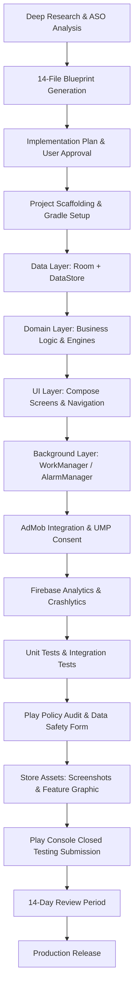

# Workflow: 02. App Research to Release (Full Lifecycle)

This workflow covers the full lifecycle of a single portfolio app, from ideation to Play Console submission.

---

## Phase 1: Documentation (Weeks 1–2)
1. Run the `01-blueprint-generation.md` workflow.
2. Verify all 14 files pass the quality gate in `guides/android-doc-generation.md`.

## Phase 2: Scaffolding (Week 3)
1. Create Android project with Gradle KTS + Version Catalog.
2. Set up Hilt DI, Room database, and DataStore.
3. Implement the Material 3 theme from `02.UI-UX-DESIGN-SYSTEM.md`.

## Phase 3: Core Implementation (Weeks 4–5)
1. Build data layer entities, DAOs, and repositories.
2. Implement domain engines (calculation, conversion, etc.).
3. Build all Compose screens following the navigation graph from `03.FUNCTIONAL-FLOWS.md`.

## Phase 4: Monetization & Telemetry (Week 6)
1. Integrate AdMob following `06.ADMOB-MONETIZATION-MAP.md`.
2. Wire Firebase Analytics events from `12.LOGGING-ANALYTICS.md`.
3. Configure Crashlytics with custom keys.

## Phase 5: QA & Release (Week 7)
1. Execute the test plan from `09.TESTING-ASSURANCE-PLAN.md`.
2. Run the Play Policy audit prompt from `prompts/review-play-policy-risk.md`.
3. Generate store screenshots and feature graphic.
4. Submit to Play Console for closed testing.

## Handoff Verification Checklist
- [ ] App compiles without errors or warnings.
- [ ] All unit tests pass.
- [ ] No `file:///` absolute links in any markdown file.
- [ ] AdMob test ads display correctly.
- [ ] Data Safety form is accurately filled.
- [ ] Store listing screenshots are captured at 1080×1920.
