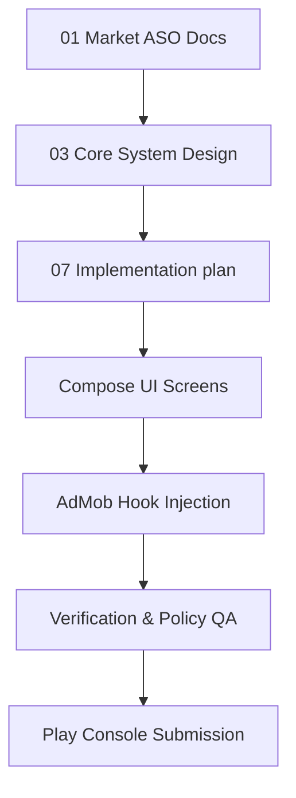

# Workflow: App Research to Release

This workflow guides the lifecycle of a single portfolio app:

## Step 1: Pre-requisites Validation
- Verify Room databases have schema export disabled or migration histories initialized.
- Check that package names match active Google Play Console registrations.

## Step 2: Handoff Verification
- Run task tests matching `10-qa-test-plan.md`.
- Verify compilation succeeds.
