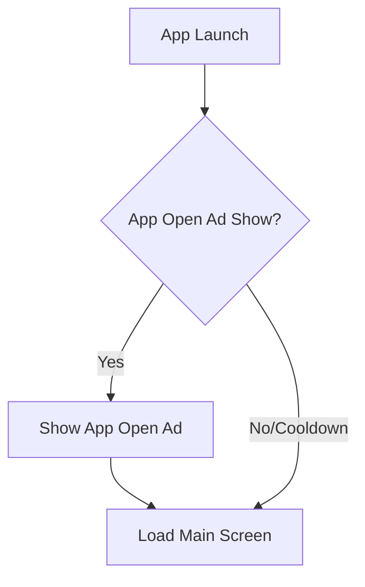

# Savior Systems: Android App Portfolio Strategy
```
This document outlines the macro strategy, market analysis, monetization thesis, and publishing methodologies for Savior Systems' high-velocity Android portfolio.
```
---
```
## 1. Portfolio Vision & Mission
```
### Vision
To build a sustainable, highly-optimized portfolio of 30+ utility and productivity Android applications that dominate search queries on Google Play and generate predictable, recurring ad revenue.
```
### Mission
To deliver lightweight, user-first, and highly-polished utility applications that solve specific daily problems, while adhering strictly to Google Play Policies and maximizing AdMob monetization.
```
---
```
## 2. Market & Revenue Thesis
```
Our strategic framework is built on a **70/30 Geographic and Utility Split**:
```
```
┌────────────────────────────────────────────────────────┐
│             Savior Systems Portfolio Split             │
├──────────────────────────┬─────────────────────────────┤
│ 70% Global Evergreen     │ 30% South Asian Local       │
│ - Target: US, UK, CA, AU │ - Target: BD, IN, PK        │
│ - eCPM: $5.00 - $30.00   │ - eCPM: $0.20 - $2.00       │
│ - High value, low volume │ - Low value, massive volume │
└──────────────────────────┴─────────────────────────────┘
```
```
### Global Evergreen Utilities (70%)
*   **Focus**: Single-purpose tools, productivity boosters, offline utilities.
*   **Geographies**: United States, United Kingdom, Canada, Australia, Germany, Japan (Tier-1).
*   **eCPM Profile**: $5.00 to $30.00+ depending on ad placement and engagement depth.
*   **ASO strategy**: Target long-tail, high-intent English keywords (e.g., "Breathing pacer offline", "Minimalist Pomodoro timer").
```
### Localized South Asian Tools (30%)
*   **Focus**: Local calculators, educational tools, region-specific utility scripts, local language helpers.
*   **Geographies**: Bangladesh, India.
*   **eCPM Profile**: $0.20 to $2.00 but driven by viral adoption, low acquisition costs, and massive daily active users (DAU).
*   **ASO Strategy**: Target native languages (Bangla, Hindi) alongside English search terms (e.g., "BD Tax Calculator 2026", "Varsity CGPA Calculator").
```
---
```
## 3. Monetization Framework
```
All apps follow a standardized **AdMob-First Monetization Model** designed to balance user experience and revenue maximization:
```

    MainScreen --> BannerAd[Render Sticky Banner Ad at Bottom]
    MainScreen --> UserAction{User Activity}
```
    UserAction -- Standard Use --> MainScreen
    UserAction -- Break Point/Task Complete --> CheckCooldown{180s Cooldown Passed?}
```
    CheckCooldown -- Yes --> InterstitialAd[Show Interstitial Ad] --> ResetTimer[Reset 180s Cooldown] --> MainScreen
    CheckCooldown -- No --> MainScreen
```
```
### Ad Placement Rules
1.  **Adaptive Sticky Banners**: Placed at the bottom of the primary activity screen. Must be loaded on creation and never block interactive controls.
2.  **Frequency-Capped Interstitials**: Shown *only* at natural transition points (e.g., when a note is saved, a calculation completes, or a timer ends). A hard frequency cap of **180 seconds** must be enforced programmatically across all screens.
3.  **Rewarded Video Ads**: Used to unlock premium UI themes, advanced templates, or historical reports for a set duration (e.g., 24 hours), avoiding intrusive paywalls.
4.  **App Open Ads**: Shown on cold starts and returns from the background, subject to a **60-second cooldown** to prevent double-serving when shifting between apps.
```
---
```
## 4. Publishing & Launch Framework
```
Our publishing roadmap employs a **Staggered Cascade Launch Model** to build momentum, secure closed testing compliance, and mitigate account risk:
```
```
[Wave 1: Simple Utilities] ──(14-Day Closed Test)──> [Production Launch]
                                                            │
    ┌───────────────────────────────────────────────────────┘
    ▼
[Wave 2: Localized Calculators] ──(14-Day Closed Test)──> [Production Launch]
                                                                │
    ┌───────────────────────────────────────────────────────────┘
    ▼
[Wave 3: Productivity Utilities] ──(14-Day Closed Test)──> [Production Launch]
                                                                │
    ┌───────────────────────────────────────────────────────────┘
    ▼
[Wave 4: Complex Specialized Tools] ──(14-Day Closed Test)──> [Production Launch]
```
```
### Staged Rollout Pipeline
1.  **Sprint Phase (3-5 Days)**: The developer designs and compiles the application bundle using standard templates.
2.  **Internal Testing (1 Day)**: Uploaded to internal tracks to check performance and ad loading.
3.  **Closed Testing (14 Days)**: Promoted to Closed Testing with 20+ opt-in testers. Testers must remain active on the build for 14 consecutive days.
4.  **Production Staging**: Staged rollout starting at 10% -> 50% -> 100% over 3 days.
```
---
```
## 5. Portfolio Brand & Architecture Isolation
```
To prevent Google Play policy flags under "Repetitive Content" or "Associated Accounts", each application must be treated as an isolated entity:
```
*   **Distinct Package Naming**: Package names must reflect the app groups, e.g., `com.saviorsystems.focus.pulse` and `com.saviorsystems.finance.expensediary`.
*   **Visual Variety**: Brand colors, typography sets, layouts, and logos must be uniquely generated for each application.
*   **Independent Repositories**: Every application must reside in its own Git repository containing separate project configurations.
*   **Isolated Assets**: Icon design elements, launcher backgrounds, and illustrations must never be reused across different apps.
```
---
```
## 6. Risk Mitigation & Compliance
```
*   **Repetitive Content**: Every app must contain at least 3 features that are completely unique to its use case. Reusing codebase shells is allowed only if the visual layout and core logic are rewritten or heavily customized.
*   **Minimal Permissions**: Apps must function offline and require **zero runtime permissions** unless strictly needed (e.g., step counter requires physical activity permission).
*   **Data Minimization**: Collect no personal data. All tools are offline-first.
```
---
```
## 7. Strategic Milestone Plan
```
### Month 1: Scurry & Foundations
*   Set up baseline templates (Theme, Navigation, AdManager, Database helper).
*   Deploy Wave 1 (Apps 1-7) into closed testing.
*   Build out ASO keywords index for all 30 apps.
```
### Month 2: Scale Development & Initial Launches
*   Promote Wave 1 to Production.
*   Develop and deploy Wave 2 (Apps 8-15) and Wave 3 (Apps 16-22) into closed testing tracks.
*   Launch localized ad campaigns for South Asian apps to boost testing volume.
```
### Month 3: Optimization & Evaluation
*   Deploy Wave 4 (Apps 23-30) into closed testing.
*   Analyze DAU and eCPM performance for Wave 1 and 2.
*   Implement "Kill vs Scale" decision rule.
```
---
```
## 8. Portfolio Decision Rules
```
```
                       ┌─────────────────────────┐
                       │   Evaluate App at 60    │
                       │     Days Post-Launch    │
                       └────────────┬────────────┘
                                    │
                  ┌─────────────────┴─────────────────┐
                  ▼                                   ▼
          [DAU < 50 Users]                    [DAU >= 100 Users]
                  │                                   │
        ┌─────────┴─────────┐               ┌─────────┴─────────┐
        ▼                   ▼               ▼                   ▼
[Retention <10%]    [Retention >=15%]    [Retention <15%]   [Retention >=20%]
   (Category 3)        (Category 2)         (Category 2)       (Category 1)
        │                   │                   │                   │
        ▼                   ▼                   ▼                   ▼
  【KILL & ARCHIVE】   【MAINTAIN ONLY】    【ASO OPTIMIZE】     【SCALE & UPDATE】
```
```
1.  **Scale & Update (Category 1)**: DAU > 100, Day-7 retention > 20%. Action: Add new features, localization, and scale ad budget.
2.  **ASO Optimize / Maintain (Category 2)**: DAU 50-100 or retention 15-20%. Action: Review title, screenshots, keywords; keep app running with zero dev overhead.
3.  **Kill & Archive (Category 3)**: DAU < 50, Day-7 retention < 10%. Action: Stop spending on ASO, remove ad units to prevent spam flags, and archive code.
```