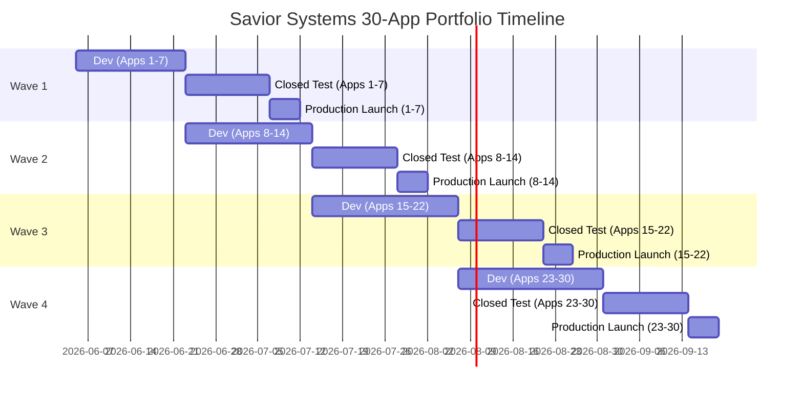

# Savior Systems: Publishing Roadmap

This roadmap defines the structured staging, rollout timeline, testing pipelines, and scaling frameworks for our 30-app portfolio.

---

## 1. Wave-Based Launch Sequencing

To maintain development velocity, applications are organized into four sequential launch waves based on technical complexity and asset requirements.

```
┌────────────────────────────────────────────────────────┐
│               Launch Waves Timeline                    │
├────────────────────────────────────────────────────────┤
│ Wave 1: Development (Weeks 1-3) -> Target Apps: 1-7     │
│ Wave 2: Development (Weeks 3-6) -> Target Apps: 8-14    │
│ Wave 3: Development (Weeks 6-10) -> Target Apps: 15-22  │
│ Wave 4: Development (Weeks 10-14) -> Target Apps: 23-30 │
└────────────────────────────────────────────────────────┘
```

### Rollout Timeline Schedule


---

## 2. Launch Checklist for Each Application

Prior to promoting any build from testing to production, the developer and owner must run the following check:

*   [ ] **Asset Prep**: 512x512 PNG App Icon, 1024x500 Feature Graphic, and 4+ actual interface device screenshots uploaded to Google Play.
*   [ ] **Closed Testing Gate**: 20 testers opted in and active in the track for 14 continuous days.
*   [ ] **Policy Match**: Privacy policy URL active and matching target domain.
*   [ ] **Ad Verification**: Verify that test ad unit IDs are replaced with live production units.

---

## 3. Staged Launch Rollout Profile

To avoid policy spikes and manage crashes:

*   **Day 1**: Staged rollout at **10%** of active traffic. Check Firebase Crashlytics on hours 1, 6, and 24.
*   **Day 2**: Increase rollout threshold to **50%**.
*   **Day 3**: Push build release to **100%** of global target markets.

---

## 4. Post-Launch 30-Day Checklist

*   **Day 1-7**: Monitor Daily Active Users (DAU) and crash logs. Fix any NullPointerExceptions immediately.
*   **Day 14**: First ASO analysis. Check search rankings for core targeted keywords on Google Play Console.
*   **Day 21**: Assess retention metrics. If Day-7 retention is below 10%, review user interface flows.
*   **Day 30**: Review AdMob impressions and CTR. Adjust refresh rates on banners if needed.
