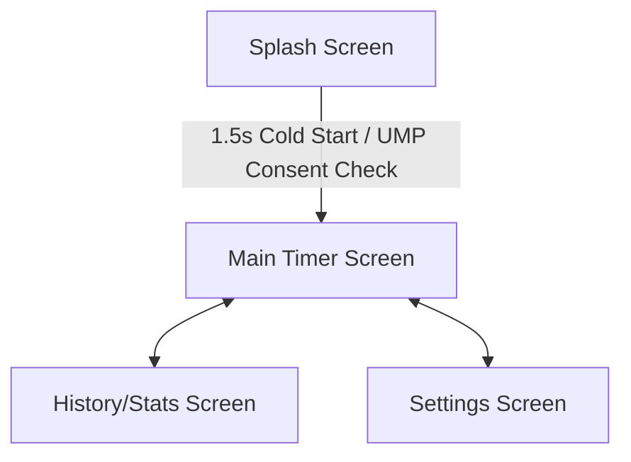

# 03. Functional Flows & Navigation

## 2. Transition Points & Ad Triggers
1.  **Timer Completion**: When the work timer countdown hits 0:00, a custom notification rings, and clicking "Dismiss/Break" triggers the AdManager.showInterstitial() flow (subject to the 180s cooldown cap).
2.  **Sound Selection Settings**: Tapping on premium soundscapes (e.g., "Forest Sounds") prompts a Rewarded ad. Upon completion, the sound is unlocked for 24 hours.
