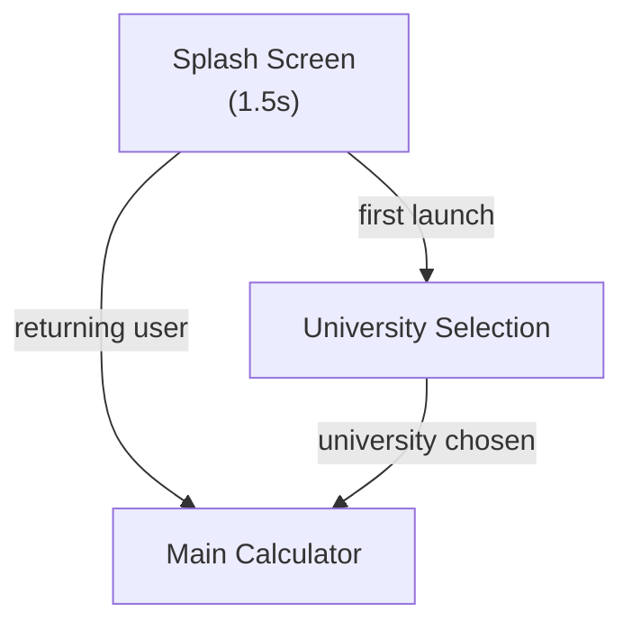
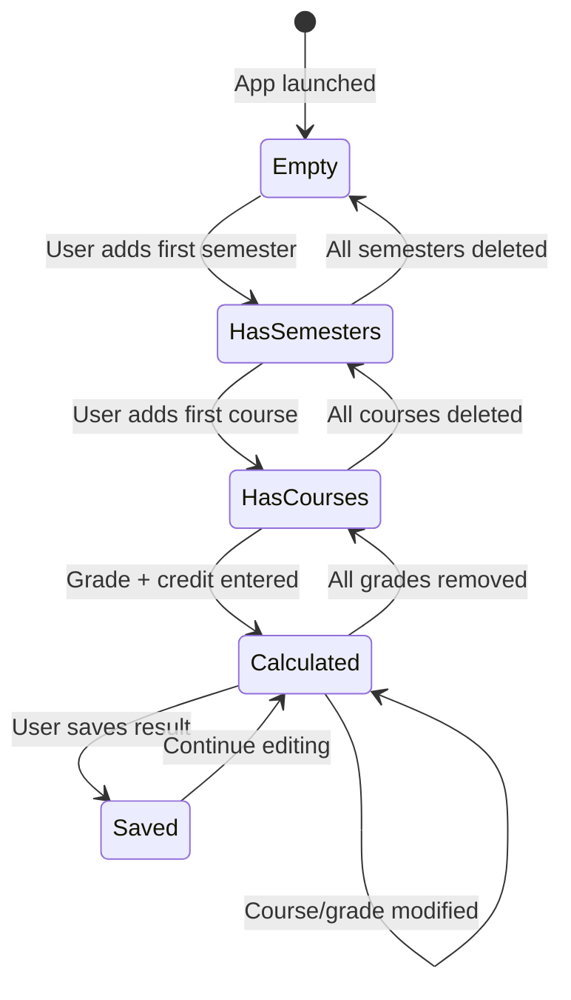

# 03. Functional Flows & Navigation
```
This document maps out complete screen transitions, user flows, and state management for **BD Varsity CGPA Pro**.
```
---
```
## 1. Complete Screen Inventory
```
| # | Screen | Route | Purpose |
|:--|:-------|:------|:--------|
| S1 | Splash Screen | — | 1.5s branded splash. Loads theme, checks consent. |
| S2 | University Selection Screen | `university_select` | First-launch only. Select university grading preset. |
| S3 | Main Calculator Screen | `calculator` (Home) | Primary screen: semester tabs, course entry, live CGPA. |
| S4 | Grade Scale Reference Screen | `grade_scale` | View selected university's grading table. |
| S5 | Calculation History Screen | `history` | View/delete saved calculation results. |
| S6 | Custom University Screen | `custom_university` | Create/edit a custom grading scale. |
| S7 | Settings Screen | `settings` | Theme, language, university change, data reset. |
| S8 | About Screen | `about` | App version, developer info, privacy policy link. |
```
---
```
## 2. Navigation Graph
```

    CALC -->|toolbar: grade table| GRADESCALE["Grade Scale Reference"]
    CALC -->|toolbar: history| HISTORY["History"]
    CALC -->|toolbar: settings| SETTINGS["Settings"]
    CALC -->|FAB: save result| SAVE_ACTION["Save & Show Interstitial"]
    CALC -->|university chip tap| UNISELECT_SHEET["University Bottom Sheet"]
```
    UNISELECT_SHEET -->|"+ Custom"| CUSTOM["Custom University"]
    CUSTOM -->|save| UNISELECT_SHEET
```
    SETTINGS -->|change university| UNISELECT
    SETTINGS -->|about| ABOUT["About"]
    SETTINGS -->|privacy policy| BROWSER["External Browser"]
```
    GRADESCALE -->|back| CALC
    HISTORY -->|back| CALC
    SETTINGS -->|back| CALC
    ABOUT -->|back| SETTINGS
```
    SAVE_ACTION -->|ad dismissed / cooldown| CALC
```
    style CALC fill:#E8F5E9,stroke:#2E7D32,color:#000
    style SPLASH fill:#F3E5F5,stroke:#6A1B9A,color:#000
    style SAVE_ACTION fill:#FFF3E0,stroke:#E65100,color:#000
```
```
### Back-Stack Rules
*   **Calculator** is always the root of the back stack.
*   Pressing Back from Calculator → exit the app (system behavior).
*   Pressing Back from any other screen → return to previous screen.
*   University Selection on first launch → Back exits app (no Calculator in stack yet).
*   Bottom sheets dismiss on Back press without navigation change.
```
---
```
## 3. User Flow: First-Time Launch
```
```mermaid
```sequenceDiagram
    participant User
    participant App
    participant DataStore
```
    User->>App: Open app
    App->>App: Show Splash Screen (1.5s)
    App->>DataStore: Check is_first_launch
    DataStore-->>App: true
    App->>App: Navigate to University Selection
    User->>App: Browse university list
    User->>App: Select "Dhaka University (DU)"
    App->>DataStore: Save selected_university_id = 1
    App->>DataStore: Set is_first_launch = false
    App->>App: Navigate to Main Calculator
    App->>User: Show empty calculator with DU grading scale loaded
```
```
---
```
## 4. User Flow: CGPA Calculation (Core Loop)
```
```mermaid
```sequenceDiagram
    participant User
    participant UI as Calculator Screen
    participant VM as CalculatorViewModel
    participant DB as Room Database
```
    User->>UI: Tap "+ Add Semester"
    UI->>VM: addSemester()
    VM-->>UI: New semester card appears
```
    User->>UI: Tap "+ Add Course" in semester
    UI->>VM: addCourse(semesterId)
    VM-->>UI: New course entry card appears
```
    User->>UI: Enter credit hours: 3.0
    UI->>VM: updateCourseCredit(courseId, 3.0)
```
    User->>UI: Select grade: "A+ (4.00)"
    UI->>VM: updateCourseGrade(courseId, "A+")
```
    VM->>VM: recalculate()
    Note right of VM: Semester GPA = Σ(GP × Credit) / Σ(Credit)<br/>Cumulative CGPA = Σ(all semester GPs × Credits) / Σ(all Credits)
```
    VM-->>UI: Update CGPA display (animated 0.00 → 4.00)
```
    User->>UI: Add more courses / semesters
    loop For each change
        UI->>VM: update...()
        VM->>VM: recalculate()
        VM-->>UI: Update CGPA display
```end
```
    User->>UI: Tap "💾 Save Result"
    UI->>VM: saveResult()
    VM->>DB: Insert into calculation_history
    VM->>VM: Check interstitial cooldown
    VM-->>UI: Show interstitial ad (if eligible)
    VM-->>UI: Show "Result saved" snackbar
```
```
---
```
## 5. User Flow: Editing Existing Data
```
```
User taps a course's grade dropdown
  → Dropdown opens with university's grade options
  → User selects new grade
  → CGPA recalculates immediately (no save/confirm needed)
  → CGPA counter animates from old value to new value
```
User taps delete icon on a course
  → Confirmation dialog: "Remove this course?"
  → Card exit animation
  → CGPA recalculates
```
User long-presses semester header
  → Context menu: Rename | Delete
  → Delete shows confirmation: "Delete semester and all courses?"
  → Courses removed, CGPA recalculates
```
```
---
```
## 6. User Flow: University Change
```
```
User taps university chip on Calculator screen
  → University bottom sheet opens
  → User selects different university
  → Warning dialog: "Changing university will clear all entered grades. Continue?"
    → Yes: Clear all courses, load new grading scale, reset CGPA to 0.00
    → No: Dismiss, keep current data
```
```
---
```
## 7. Calculator State Machine
```

    state Calculated {
        [*] --> LiveRecalc
        LiveRecalc --> LiveRecalc: Any input change
    }
```
```
---
```
## 8. Ad Trigger Points
```
| Trigger | Ad Format | Condition |
|:--------|:----------|:----------|
| Main calculator screen loads | Adaptive Banner | Always (bottom of screen) |
| After "Save Result" action | Interstitial | 180s cooldown enforced |
| App cold start / return from background | App Open Ad (optional, v2) | 60s cooldown |
```
### Ad Flow
```
User taps "Save Result"
  → ViewModel saves to database
  → ViewModel checks: (currentTime - lastAdTime) >= 180s?
    → Yes: Show interstitial → On dismiss: show snackbar "Saved!"
    → No: Show snackbar "Saved!" immediately (skip ad)
```
```
---
```
## 9. Error States & Empty States
```
| Screen / State | Empty State Message | Icon |
|:---------------|:--------------------|:-----|
| Calculator (no semesters) | "Tap + to add your first semester and start calculating your CGPA" | `Icons.Filled.School` |
| Semester (no courses) | "Add courses to this semester to calculate GPA" | `Icons.Filled.Add` |
| History (no saved results) | "No saved calculations yet. Calculate your CGPA and save the result." | `Icons.Filled.History` |
| University search (no match) | "No universities found. Try a different search or add a custom university." | `Icons.Filled.SearchOff` |
```
| Error State | Message | Recovery Action |
|:------------|:--------|:----------------|
| Invalid credit hours (0 or negative) | "Credit hours must be between 0.5 and 6.0" | Inline field error |
| No grade selected for a course | "Select a grade to include this course in the calculation" | Highlight dropdown |
| Database write failure | "Failed to save. Please try again." | Retry button in snackbar |
```