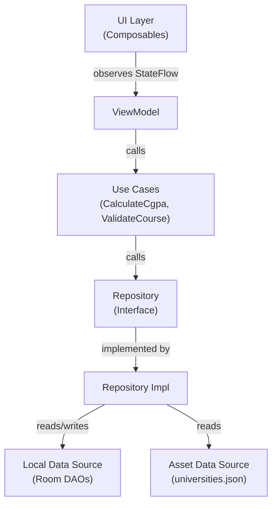

# 04. Technical Architecture Blueprint
```
All code in this project follows Clean MVVM standards as defined in the [DEVELOPER-GUIDE.md](../DEVELOPER-GUIDE.md).
```
---
```
## 1. Package Structure
```
```
com.saviorsystems.education.bdcgpa/
├── App.kt                              ← @HiltAndroidApp Application class
├── MainActivity.kt                     ← Single-Activity, hosts ComposeNavHost
│
├── data/
│   ├── local/
│   │   ├── BdCgpaDatabase.kt           ← Room database (version 1)
│   │   ├── dao/
│   │   │   ├── UniversityDao.kt        ← CRUD for university presets + custom
│   │   │   ├── SemesterDao.kt          ← CRUD for semesters
│   │   │   ├── CourseDao.kt            ← CRUD for courses within semesters
│   │   │   └── HistoryDao.kt           ← Insert/query/delete saved results
│   │   ├── entity/
│   │   │   ├── UniversityEntity.kt     ← University table entity
│   │   │   ├── SemesterEntity.kt       ← Semester table entity
│   │   │   ├── CourseEntity.kt         ← Course table entity
│   │   │   └── HistoryEntity.kt        ← Calculation history entity
│   │   └── converter/
│   │       └── GradeScaleConverter.kt  ← TypeConverter for List<GradeEntry> ↔ JSON
│   ├── repository/
│   │   ├── UniversityRepositoryImpl.kt
│   │   ├── CalculatorRepositoryImpl.kt
│   │   └── HistoryRepositoryImpl.kt
│   └── mapper/
│       ├── UniversityMapper.kt         ← Entity ↔ Domain model mapping
│       ├── SemesterMapper.kt
│       └── CourseMapper.kt
│
├── domain/
│   ├── model/
│   │   ├── University.kt               ← Domain model
│   │   ├── GradeEntry.kt               ← Single grade-point mapping
│   │   ├── Semester.kt                 ← Semester with courses
│   │   ├── Course.kt                   ← Individual course
│   │   └── CgpaResult.kt              ← Calculation result value object
│   ├── repository/
│   │   ├── UniversityRepository.kt     ← Interface
│   │   ├── CalculatorRepository.kt     ← Interface
│   │   └── HistoryRepository.kt        ← Interface
│   └── usecase/
│       ├── CalculateCgpaUseCase.kt     ← Core CGPA calculation logic
│       └── ValidateCourseUseCase.kt    ← Input validation
│
├── ui/
│   ├── theme/
│   │   ├── Color.kt                    ← Light/Dark color schemes (see 02.UI-UX)
│   │   ├── Theme.kt                    ← AppTheme composable
│   │   └── Type.kt                     ← Outfit typography definitions
│   ├── navigation/
│   │   ├── AppNavGraph.kt              ← NavHost with all routes
│   │   └── Screen.kt                   ← Sealed class for route definitions
│   ├── screens/
│   │   ├── splash/
│   │   │   └── SplashScreen.kt
│   │   ├── universityselect/
│   │   │   ├── UniversitySelectScreen.kt
│   │   │   └── UniversitySelectViewModel.kt
│   │   ├── calculator/
│   │   │   ├── CalculatorScreen.kt     ← Main screen composable
│   │   │   ├── CalculatorViewModel.kt  ← Core state manager
│   │   │   └── components/
│   │   │       ├── CgpaResultCard.kt   ← Hero CGPA display
│   │   │       ├── SemesterSection.kt  ← Collapsible semester
│   │   │       ├── CourseEntryCard.kt  ← Course input card
│   │   │       └── GradeDropdown.kt   ← Grade selector
│   │   ├── gradescale/
│   │   │   ├── GradeScaleScreen.kt
│   │   │   └── GradeScaleViewModel.kt
│   │   ├── history/
│   │   │   ├── HistoryScreen.kt
│   │   │   └── HistoryViewModel.kt
│   │   ├── customuniversity/
│   │   │   ├── CustomUniversityScreen.kt
│   │   │   └── CustomUniversityViewModel.kt
│   │   ├── settings/
│   │   │   ├── SettingsScreen.kt
│   │   │   └── SettingsViewModel.kt
│   │   └── about/
│   │       └── AboutScreen.kt
│   └── components/                      ← Shared reusable composables
│       ├── EmptyStateView.kt
│       ├── LoadingView.kt
│       └── ErrorView.kt
│
├── di/
│   ├── AppModule.kt                    ← Provides DataStore, shared prefs
│   ├── DatabaseModule.kt              ← Provides Room DB, DAOs
│   └── RepositoryModule.kt            ← Binds interfaces to implementations
│
├── ads/
│   └── AdManager.kt                    ← From REUSABLE-ANDROID-COMPONENTS.md
│
└── util/
    ├── Extensions.kt                   ← Kotlin extension functions
    ├── Constants.kt                    ← App-wide constants
    └── NumberFormatUtil.kt             ← CGPA formatting (2 decimal places)
```
```
---
```
## 2. MVVM Layer Diagram
```

    style A fill:#E8F5E9,stroke:#2E7D32,color:#000
    style B fill:#FFF3E0,stroke:#E65100,color:#000
    style C fill:#E3F2FD,stroke:#1565C0,color:#000
    style D fill:#F3E5F5,stroke:#6A1B9A,color:#000
    style E fill:#F3E5F5,stroke:#6A1B9A,color:#000
    style F fill:#FCE4EC,stroke:#AD1457,color:#000
    style G fill:#FCE4EC,stroke:#AD1457,color:#000
```
```
---
```
## 3. Domain Models
```
```kotlin
// University with its grading scale
data class University(
    val id: Int,
    val name: String,                    // "Dhaka University (DU)"
    val nameBn: String,                  // "ঢাকা বিশ্ববিদ্যালয় (ঢাবি)"
    val shortName: String,               // "DU"
    val type: UniversityType,            // PUBLIC or PRIVATE
    val isCustom: Boolean,               // true if user-created
    val gradeScale: List<GradeEntry>,    // Ordered list of grades
)
```
enum class UniversityType { PUBLIC, PRIVATE, CUSTOM }
```
// Single grade-point mapping within a university's scale
data class GradeEntry(
    val letterGrade: String,             // "A+"
    val gradePoint: Double,              // 4.00
    val minPercentage: Int?,             // 80 (nullable for custom scales)
    val maxPercentage: Int?,             // 100
)
```
// Semester holding courses
data class Semester(
    val id: Long,
    val name: String,                    // "Semester 1" or user-defined
    val orderIndex: Int,                 // Display order
    val courses: List<Course>,           // Courses in this semester
)
```
// Individual course within a semester
data class Course(
    val id: Long,
    val semesterId: Long,
    val name: String,                    // "Data Structures" (optional)
    val creditHours: Double,             // 3.0
    val letterGrade: String?,            // "A+" or null if not yet graded
    val gradePoint: Double?,             // 4.00 (derived from letterGrade + university scale)
)
```
// Computed result value object
data class CgpaResult(
    val semesterGpa: Double,             // GPA for a single semester
    val cumulativeCgpa: Double,          // CGPA across all semesters
    val totalCredits: Double,            // Sum of all credit hours
    val totalGradePoints: Double,        // Sum of (GP × Credit) for all courses
    val semesterCount: Int,              // Number of semesters
    val courseCount: Int,                 // Number of graded courses
)
```
```
---
```
## 4. CGPA Calculation Algorithm
```
### Mathematical Formula
```
```
Semester GPA = Σ(course_grade_point × course_credit_hours) / Σ(course_credit_hours)
                  for all courses in a single semester
```
Cumulative CGPA = Σ(course_grade_point × course_credit_hours) / Σ(course_credit_hours)
                      for ALL courses across ALL semesters
```
```
### Kotlin Implementation
```
```kotlin
class CalculateCgpaUseCase @Inject constructor() {
```
    /**
     * Calculates semester GPA and cumulative CGPA from a list of semesters.
     *
     * Rules:
     * - Courses without a grade (letterGrade == null) are excluded.
     * - Courses with creditHours <= 0 are excluded.
     * - If no valid courses exist, returns 0.00.
     * - Result is rounded to 2 decimal places.
     */
    operator fun invoke(semesters: List<Semester>): CgpaResult {
        var totalCredits = 0.0
        var totalWeightedPoints = 0.0
        var courseCount = 0
```
        val semesterGpas = semesters.map { semester ->
            var semCredits = 0.0
            var semPoints = 0.0
```
            semester.courses.forEach { course ->
                if (course.gradePoint != null && course.creditHours > 0) {
                    semCredits += course.creditHours
                    semPoints += course.gradePoint * course.creditHours
                    courseCount++
                }
            }
```
            totalCredits += semCredits
            totalWeightedPoints += semPoints
```
            if (semCredits > 0) semPoints / semCredits else 0.0
        }
```
        val cumulativeCgpa = if (totalCredits > 0) {
            totalWeightedPoints / totalCredits
        } else {
            0.0
        }
```
        return CgpaResult(
            semesterGpa = semesterGpas.lastOrNull() ?: 0.0,
            cumulativeCgpa = roundToTwoDecimals(cumulativeCgpa),
            totalCredits = totalCredits,
            totalGradePoints = totalWeightedPoints,
            semesterCount = semesters.size,
            courseCount = courseCount,
        )
    }
```
    private fun roundToTwoDecimals(value: Double): Double {
        return (Math.round(value * 100.0) / 100.0)
    }
}
```
```
---
```
## 5. ViewModel State Management
```
### CalculatorViewModel
```
```kotlin
@HiltViewModel
class CalculatorViewModel @Inject constructor(
    private val universityRepository: UniversityRepository,
    private val calculatorRepository: CalculatorRepository,
    private val historyRepository: HistoryRepository,
    private val calculateCgpa: CalculateCgpaUseCase,
) : ViewModel() {
```
    private val _uiState = MutableStateFlow<CalculatorUiState>(CalculatorUiState.Loading)
    val uiState: StateFlow<CalculatorUiState> = _uiState.asStateFlow()
}
```
sealed interface CalculatorUiState {
    data object Loading : CalculatorUiState
    data class Ready(
        val university: University,
        val semesters: List<Semester>,
        val result: CgpaResult,
    ) : CalculatorUiState
    data class Error(val message: String) : CalculatorUiState
}
```
```
### UniversitySelectViewModel
```
```kotlin
sealed interface UniversitySelectUiState {
    data object Loading : UniversitySelectUiState
    data class Success(
        val publicUniversities: List<University>,
        val privateUniversities: List<University>,
        val customUniversities: List<University>,
        val selectedId: Int?,
        val searchQuery: String,
    ) : UniversitySelectUiState
}
```
```
### HistoryViewModel
```
```kotlin
sealed interface HistoryUiState {
    data object Loading : HistoryUiState
    data class Success(val results: List<SavedResult>) : HistoryUiState
    data object Empty : HistoryUiState
}
```
```
---
```
## 6. Navigation Route Definitions
```
```kotlin
sealed class Screen(val route: String) {
    data object Splash : Screen("splash")
    data object UniversitySelect : Screen("university_select")
    data object Calculator : Screen("calculator")
    data object GradeScale : Screen("grade_scale/{universityId}") {
        fun createRoute(universityId: Int) = "grade_scale/$universityId"
    }
    data object History : Screen("history")
    data object CustomUniversity : Screen("custom_university")
    data object Settings : Screen("settings")
    data object About : Screen("about")
}
```
```
---
```
## 7. Dependency Injection (Hilt Modules)
```
### DatabaseModule
```kotlin
@Module
@InstallIn(SingletonComponent::class)
object DatabaseModule {
    @Provides
    @Singleton
    fun provideDatabase(@ApplicationContext context: Context): BdCgpaDatabase {
        return Room.databaseBuilder(context, BdCgpaDatabase::class.java, "bd_cgpa_db")
            .createFromAsset("databases/universities.db")  // Pre-populated data
            .fallbackToDestructiveMigration()
            .build()
    }
```
    @Provides fun provideUniversityDao(db: BdCgpaDatabase) = db.universityDao()
    @Provides fun provideSemesterDao(db: BdCgpaDatabase) = db.semesterDao()
    @Provides fun provideCourseDao(db: BdCgpaDatabase) = db.courseDao()
    @Provides fun provideHistoryDao(db: BdCgpaDatabase) = db.historyDao()
}
```
```
### RepositoryModule
```kotlin
@Module
@InstallIn(SingletonComponent::class)
abstract class RepositoryModule {
    @Binds abstract fun bindUniversityRepo(impl: UniversityRepositoryImpl): UniversityRepository
    @Binds abstract fun bindCalculatorRepo(impl: CalculatorRepositoryImpl): CalculatorRepository
    @Binds abstract fun bindHistoryRepo(impl: HistoryRepositoryImpl): HistoryRepository
}
```
```
---
```
## 8. Data Flow Diagram
```
```mermaid
flowchart LR
    subgraph Assets
        JSON["universities.json<br/>(Pre-populated)"]
```end
    subgraph Data Layer
        DB["Room Database"]
        DS["DataStore<br/>(Preferences)"]
```end
    subgraph Domain Layer
        REPO["Repositories"]
        UC["Use Cases"]
```end
    subgraph UI Layer
        VM["ViewModels"]
        SCREEN["Composables"]
```end
```
    JSON -->|"createFromAsset"| DB
    DB -->|"Flow<List>"| REPO
    DS -->|"Flow<Prefs>"| REPO
    REPO -->|"interface"| UC
    UC -->|"domain models"| VM
    VM -->|"StateFlow"| SCREEN
```
    style JSON fill:#FFF9C4,stroke:#F57F17,color:#000
    style DB fill:#F3E5F5,stroke:#6A1B9A,color:#000
    style DS fill:#F3E5F5,stroke:#6A1B9A,color:#000
    style REPO fill:#E8F5E9,stroke:#2E7D32,color:#000
    style UC fill:#E3F2FD,stroke:#1565C0,color:#000
    style VM fill:#FFF3E0,stroke:#E65100,color:#000
    style SCREEN fill:#E8F5E9,stroke:#2E7D32,color:#000
```
```