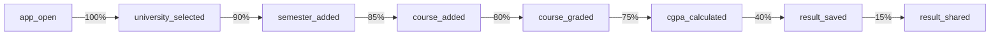

# 12. Logging & Analytics
```
This document defines the Firebase Analytics event tracking strategy for **BD Varsity CGPA Pro**, including all custom events, user properties, and conversion metrics.
```
---
```
## 1. Firebase Setup
```
*   **Firebase Project**: Savior Systems — BD Varsity CGPA Pro
*   **SDK**: Firebase BOM (see `libs.versions.toml` in [DEVELOPER-GUIDE.md](../DEVELOPER-GUIDE.md))
*   **Services Used**:
    *   Firebase Analytics (usage tracking)
    *   Firebase Crashlytics (crash reporting)
*   **DebugView**: Verify all events using `adb shell setprop debug.firebase.analytics.app com.saviorsystems.education.bdcgpa`
```
---
```
## 2. Custom Analytics Events
```
All event names follow Firebase naming conventions: `snake_case`, max 40 characters, max 25 custom parameters per event.
```
### Core User Actions
```
| Event Name | Trigger | Parameters | Purpose |
|:-----------|:--------|:-----------|:--------|
| `app_open` | App cold start or foreground return | `open_type`: "cold" / "warm" | Track session starts |
| `university_selected` | User selects/changes university | `university_name`: String, `university_short`: String, `university_type`: "public" / "private" / "custom", `is_first_selection`: Boolean | Track university preference distribution |
| `semester_added` | User adds a new semester | `semester_index`: Int, `university_short`: String | Track engagement depth |
| `semester_deleted` | User deletes a semester | `semester_index`: Int, `course_count`: Int | Track destructive actions |
| `course_added` | User adds a course to a semester | `semester_index`: Int, `credit_hours`: Double | Track input volume |
| `course_graded` | User selects a grade for a course | `letter_grade`: String, `grade_point`: Double, `credit_hours`: Double | Track grade distribution |
| `cgpa_calculated` | CGPA recalculation completes (debounced, max 1/sec) | `cgpa_result`: Double, `semester_count`: Int, `total_credits`: Double, `course_count`: Int, `university_short`: String | **Conversion event** — core value delivery |
| `result_saved` | User saves calculation to history | `cgpa_result`: Double, `university_short`: String, `semester_count`: Int | **Conversion event** — high engagement signal |
| `result_shared` | User shares CGPA via share sheet | `share_method`: String (if detectable), `cgpa_result`: Double | Track viral loop |
| `grade_scale_viewed` | User opens grade scale reference | `university_short`: String | Track reference usage |
| `history_viewed` | User opens history screen | `saved_count`: Int | Track history feature engagement |
| `history_cleared` | User clears all history | `deleted_count`: Int | Track data management |
```
### Custom University Events
```
| Event Name | Trigger | Parameters | Purpose |
|:-----------|:--------|:-----------|:--------|
| `custom_university_created` | User saves a new custom university | `university_name`: String, `grade_count`: Int | Track custom scale usage |
| `custom_university_deleted` | User deletes a custom university | `university_name`: String | Track custom scale lifecycle |
```
### Settings & Preferences
```
| Event Name | Trigger | Parameters | Purpose |
|:-----------|:--------|:-----------|:--------|
| `theme_changed` | User changes theme mode | `theme_mode`: "system" / "light" / "dark" | Track theme preferences |
| `language_changed` | User changes language | `language_code`: "en" / "bn", `previous_language`: String | Track language preference |
| `data_cleared` | User clears all data from Settings | — | Track reset frequency |
```
### Ad Events
```
| Event Name | Trigger | Parameters | Purpose |
|:-----------|:--------|:-----------|:--------|
| `ad_banner_loaded` | Banner ad successfully loads | `ad_unit`: String | Track ad fill rate |
| `ad_banner_failed` | Banner ad fails to load | `error_code`: Int, `error_message`: String | Debug ad issues |
| `ad_interstitial_shown` | Interstitial ad displayed | `trigger_point`: "save_result" | Track ad impression |
| `ad_interstitial_skipped` | Interstitial skipped (cooldown active) | `seconds_remaining`: Long | Track cooldown effectiveness |
| `ad_interstitial_failed` | Interstitial fails to show | `error_code`: Int | Debug ad issues |
```
---
```
## 3. User Properties
```
Set once or update when values change. Used for audience segmentation in Firebase Console.
```
| Property Name | Type | Set When | Example Values |
|:--------------|:-----|:---------|:---------------|
| `selected_university` | String | University selection changes | "DU", "NU", "BUET", "NSU" |
| `preferred_language` | String | Language setting changes | "en", "bn" |
| `theme_mode` | String | Theme setting changes | "system", "light", "dark" |
| `has_custom_university` | String | Custom university created/deleted | "true", "false" |
| `total_saves` | String | After each result_saved | "0", "1", "5", "10+" |
```
```kotlin
// Example: Setting user properties
Firebase.analytics.setUserProperty("selected_university", "DU")
Firebase.analytics.setUserProperty("preferred_language", "en")
Firebase.analytics.setUserProperty("theme_mode", "dark")
```
```
---
```
## 4. Conversion Events
```
These events are marked as **conversions** in Firebase Console for funnel analysis:
```
| Conversion Event | Why It Matters |
|:-----------------|:---------------|
| `cgpa_calculated` | Core value delivery — user got what they came for |
| `result_saved` | Deep engagement — user finds value worth saving |
| `result_shared` | Viral loop — potential organic user acquisition |
```
### Funnel Definition
```

    style F fill:#E8F5E9,stroke:#2E7D32,color:#000
    style G fill:#C8E6C9,stroke:#2E7D32,color:#000
    style H fill:#FFF9C4,stroke:#F57F17,color:#000
```
```
*   **Target**: ≥75% of sessions reach `cgpa_calculated`
*   **Target**: ≥40% of calculations are saved
*   **Target**: ≥15% of saves are shared
```
---
```
## 5. Firebase Crashlytics
```
*   **Enabled**: Yes, in production builds
*   **Non-Fatal Logging**: Log non-fatal exceptions for:
    *   Database write failures
    *   JSON parsing errors in university grading data
    *   Ad load failures
*   **Custom Keys**:
    *   `selected_university`: Current university short name
    *   `semester_count`: Number of active semesters
    *   `course_count`: Number of active courses
```
```kotlin
// Example: Non-fatal exception logging
Firebase.crashlytics.apply {
    setCustomKey("selected_university", "DU")
    setCustomKey("semester_count", 4)
    recordException(exception)
}
```
```
---
```
## 6. Event Naming Rules
```
*   All event names: `snake_case`
*   Max event name length: 40 characters
*   Max parameters per event: 25
*   Max parameter name length: 40 characters
*   Max parameter value length: 100 characters (String)
*   Do NOT log PII (names, emails, phone numbers)
*   Do NOT log raw grade data that could identify a student
```
---
```
## 7. Analytics Checklist
```
*   [ ] Firebase Analytics SDK added to `build.gradle.kts`
*   [ ] Firebase Crashlytics SDK added to `build.gradle.kts`
*   [ ] `google-services.json` placed in `app/` directory
*   [ ] All 17 custom events implemented and firing
*   [ ] All 5 user properties set correctly
*   [ ] 3 conversion events marked in Firebase Console
*   [ ] Events verified in Firebase DebugView
*   [ ] Non-fatal exceptions logged via Crashlytics
*   [ ] No PII logged in any event parameter
*   [ ] Event debouncing applied to `cgpa_calculated` (max 1 per second)
```