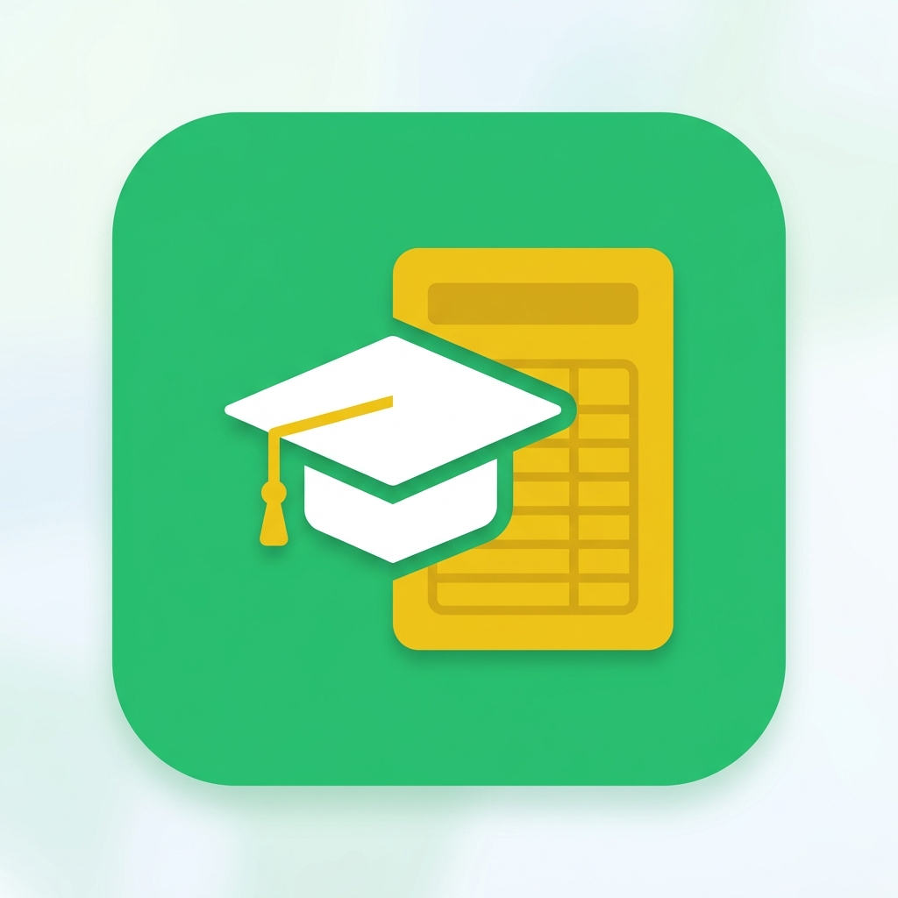

# BD Varsity CGPA Pro — Master Index

> **Package**: `com.saviorsystems.education.bdcgpa`
> **Category**: Education · **Target Market**: South Asia (Bangladesh)
> **Complexity**: 1/5 · **Est. Build**: 3 Days · **Offline**: 100%

## 🎨 App Icon Showcase

---

Welcome to the design and development blueprint directory for **BD Varsity CGPA Pro** — a lightweight, offline-first CGPA calculator built specifically for Bangladeshi university students. The app ships with pre-loaded grading scales for 17+ public and private universities across Bangladesh (DU, NU, BUET, BRAC, NSU, and more), enabling students to calculate their semester GPA and cumulative CGPA with zero configuration.

---

## 🎯 Key Differentiators

| Feature | Description |
|:--------|:------------|
| **University Preset Library** | 17+ BD university grading scales (DU, NU, BUET, BRAC, NSU, IUB, AIUB, etc.) pre-loaded and ready to use |
| **Offline-First** | Works 100% without internet. All grading data stored locally. |
| **Bangla + English** | Full bilingual UI — toggle between English and বাংলা at any time |
| **Semester Management** | Organize courses by semester, track GPA per semester and cumulative CGPA |
| **Custom Grading Scales** | Create your own grading scale for unlisted universities |
| **Zero Permissions** | No camera, no location, no contacts — nothing. Just grades. |

---

## 🎨 Quick Reference Card

| Item | Value |
|:-----|:------|
| Package Name | `com.saviorsystems.education.bdcgpa` |
| Primary Color | `0xFF2ECC71` (Emerald Green) |
| Secondary Color | `0xFF34495E` (Wet Asphalt) |
| Font Family | Outfit (Google Fonts) |
| Min SDK | 24 (Android 7.0) |
| Target SDK | 35 (Android 15) |
| Architecture | MVVM + Clean Architecture |
| DI | Hilt |
| Database | Room + DataStore |
| Ads | AdMob (Banner + Interstitial) |
| Analytics | Firebase Analytics |

---

## 📂 Documentation Directory Map

Click any section below to navigate to its blueprint:

| # | Document | Purpose |
|:--|:---------|:--------|
| 01 | [PRD-REQUIREMENTS.md](./01.PRD-REQUIREMENTS.md) | Feature list, user stories, target personas, success metrics |
| 02 | [UI-UX-DESIGN-SYSTEM.md](./02.UI-UX-DESIGN-SYSTEM.md) | Color palette, typography, component library, layout specs |
| 03 | [FUNCTIONAL-FLOWS.md](./03.FUNCTIONAL-FLOWS.md) | Screen inventory, navigation graph, user flow diagrams |
| 04 | [TECHNICAL-ARCHITECTURE.md](./04.TECHNICAL-ARCHITECTURE.md) | Package structure, domain models, CGPA algorithm, DI setup |
| 05 | [DATABASE-SCHEMA.md](./05.DATABASE-SCHEMA.md) | Room entities, DAO interfaces, DataStore prefs, pre-populated data |
| 06 | [ADMOB-MONETIZATION-MAP.md](./06.ADMOB-MONETIZATION-MAP.md) | Ad formats, placement triggers, eCPM expectations |
| 07 | [ASO-PLAY-STORE-LISTING.md](./07.ASO-PLAY-STORE-LISTING.md) | Play Store title, descriptions, keywords, screenshot briefs |
| 08 | [PLAY-POLICY-SAFETY.md](./08.PLAY-POLICY-SAFETY.md) | Permissions, data safety, IARC rating, policy compliance |
| 09 | [TESTING-ASSURANCE-PLAN.md](./09.TESTING-ASSURANCE-PLAN.md) | CGPA calculation tests, UI tests, edge cases, device matrix |
| 10 | [TRANSLATIONS-LOCALIZATION.md](./10.TRANSLATIONS-LOCALIZATION.md) | Full English + Bangla string resources, number formatting |
| 11 | [GRAPHIC-ASSETS-MANIFEST.md](./11.GRAPHIC-ASSETS-MANIFEST.md) | App icon specs, Play Store graphics, screenshot content plan |
| 12 | [LOGGING-ANALYTICS.md](./12.LOGGING-ANALYTICS.md) | Firebase events, user properties, conversion tracking |
| 13 | [BACKLOG-TASKS.md](./13.BACKLOG-TASKS.md) | Phased development backlog with acceptance criteria |

---

**Status**: ✅ Documentation complete. Ready for scaffolding and development.
All configuration keys must pull from the root blueprints: [DEVELOPER-GUIDE.md](../DEVELOPER-GUIDE.md) · [REUSABLE-ANDROID-COMPONENTS.md](../REUSABLE-ANDROID-COMPONENTS.md) · [MASTER-CHECKLIST.md](../MASTER-CHECKLIST.md)

---
## ☁️ GCP & Firebase API Setup & SOP

### 1. Required Cloud API Category
- **Category:** Level 1 (Telemetry, UMP Consent, and AdMob)
- **Core APIs:** \irebase.googleapis.com\ (Free Tier)
- **SOP Implementation:** Log ASO conversion metrics, standard analytics telemetry, and initialize UMP consent logs.\

### 2. Credentials & Config Mapping
- Place the downloaded \google-services.json\ config inside the \pp/\ directory.
- Production credentials are dynamically configured on launch and kept out of Git repository logs.
