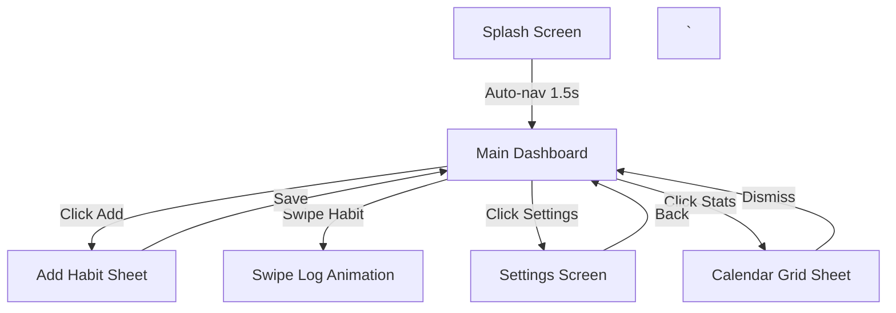

# 03. Functional Flows — MicroHabit Tracker
`
This document maps the user navigation flow, state transitions, and UI check gates for MicroHabit Tracker.
`
---
`
## 1. Screen Transitions Diagram
`

`
---
`
## 2. Key User Journeys
`
### 2.1 Onboarding & Creation
1. User opens the app from cold start.
2. If database is empty, dashboard displays the empty state with a "Create First MicroHabit" CTA.
3. User clicks the CTA to slide up the bottom sheet.
4. User enters habit name (e.g., "Read 2 Pages"), selects frequency (daily), and sets a daily reminder time.
5. User clicks "Save". The sheet collapses, and the habit list updates.
`
### 2.2 Swiping to Complete
1. On the dashboard, user swip-rights the target habit card.
2. A green check icon is revealed, and the card bounces back.
3. The Room DB increments the `streakCount`, logs the timestamp, and the card's visual state changes to "Done".
`
### 2.3 Streak Freeze Activation
1. User taps the Freeze icon on a habit.
2. If they have an available freeze token, the habit is marked as "Frozen" for the current local day, protecting the active streak.
`