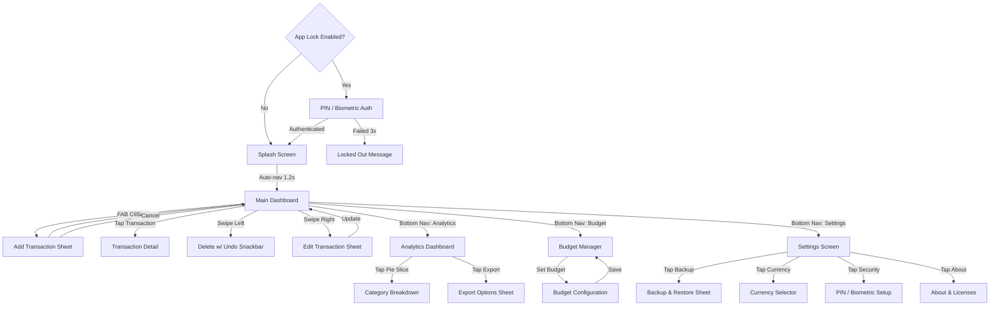

# 03. Functional Flows & Navigation — Expense Diary Local

This document maps the user navigation flow, state transitions, and UI interaction gates for Expense Diary Local.

---

## 1. Screen Transitions Diagram

---

## 2. Bottom Navigation Architecture

| Index | Label | Icon | Destination |
| :--- | :--- | :--- | :--- |
| 0 | **Home** | `Icons.Rounded.Home` | Main Dashboard (Transaction List) |
| 1 | **Analytics** | `Icons.Rounded.PieChart` | Analytics Dashboard (Charts & Stats) |
| 2 | **Budget** | `Icons.Rounded.AccountBalance` | Budget Manager (Limits & Progress) |
| 3 | **Settings** | `Icons.Rounded.Settings` | Settings & Preferences |

*   **FAB Overlay**: The "Add Transaction" FAB floats above the bottom nav bar across all destinations except Settings.
*   **Badge Indicator**: Budget tab shows a red dot badge when any category exceeds 80% of its limit.

---

## 3. Key User Journeys

### 3.1 First Launch & Onboarding
1.  User opens app for the first time after install.
2.  Splash screen displays the Expense Diary Local logo with a fade-in animation (1.2s).
3.  Dashboard appears with an **Empty State** illustration and CTA: *"Log Your First Expense"*.
4.  User taps the FAB → Add Transaction bottom sheet slides up.
5.  User enters amount (`₹500`), selects category (`🍔 Food`), adds note (`"Lunch"`), and taps **Save**.
6.  Transaction appears in the list. Empty state is replaced with the live transaction feed.

### 3.2 Daily Expense Logging (< 5 Seconds)
1.  User opens app → Dashboard loads instantly (Room + StateFlow, no network wait).
2.  User taps FAB → Amount keypad is auto-focused.
3.  User types `120` → taps `Transport` icon → taps **Save**.
4.  Bottom sheet dismisses. New entry animates into the list with a slide-down entrance.
5.  **Total**: ~4 seconds from app-open to logged entry.

### 3.3 Budget Alert Flow
1.  User navigates to Budget tab → Sets monthly limit of `₹15,000`.
2.  Optionally sets per-category limits (e.g., `Food: ₹5,000`).
3.  When cumulative spending reaches 80% (`₹12,000`), a local notification fires:
    *   Title: "Budget Alert ⚠️"
    *   Body: "You've spent ₹12,000 of your ₹15,000 monthly budget."
4.  At 100%, a critical notification fires with a different tone and "Budget Exceeded" label.

### 3.4 Analytics Deep Dive
1.  User taps **Analytics** tab → Pie chart renders with smooth draw animation.
2.  User taps the "Food" slice → Slice expands, tooltip shows: `Food: ₹4,200 (28%)`.
3.  User scrolls down to the monthly bar chart → Swipes horizontally to compare months.
4.  User taps **Export** → Selects CSV or PDF → File saved to `Downloads/ExpenseDiary/`.

### 3.5 Backup & Restore
1.  User navigates to Settings → Backup & Restore.
2.  Taps **Create Backup** → JSON file is generated with AES-encrypted payload.
3.  File saved to `Downloads/ExpenseDiary/backup_2026-06-06.json`.
4.  On a new device, user installs app → Settings → Restore → Picks the backup file → Data is restored.

---

## 4. State Management Rules

### 4.1 Screen State Preservation
*   All ViewModel states are backed by `SavedStateHandle` to survive process death.
*   Transaction entry draft is auto-saved to DataStore if the user navigates away mid-entry.

### 4.2 Ad Trigger Points
*   **Interstitial Ad**: Shown after every 5th transaction save (frequency cap: max 1 per 180 seconds).
*   **Banner Ad**: Persistent adaptive banner anchored to the bottom of the Dashboard screen.
*   **No Ads on**: Settings, Budget configuration, and Security setup screens (policy-safe zones).
