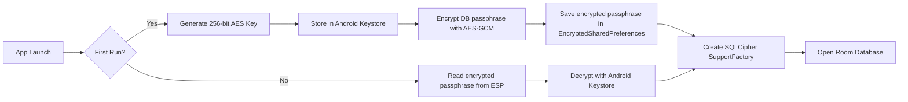

# 04. Technical Architecture Blueprint — Expense Diary Local
```
All code in this project follows Clean Architecture with MVVM standards, isolating business logic from the UI framework.
```
---
```
## 1. Directory Structure
```
```
com.saviorsystems.expensediarylocal/
├── data/
│   ├── local/
│   │   ├── AppDatabase.kt                    # Room DB singleton (version 1, SQLCipher encrypted)
│   │   ├── converter/
│   │   │   └── DateConverter.kt              # TypeConverter: Long ↔ LocalDate
│   │   ├── dao/
│   │   │   ├── TransactionDao.kt             # CRUD + aggregate queries for transactions
│   │   │   ├── CategoryDao.kt                # Custom category management queries
│   │   │   └── BudgetDao.kt                  # Budget limit read/write queries
│   │   └── entity/
│   │       ├── TransactionEntity.kt          # Core financial record entity
│   │       ├── CategoryEntity.kt             # User-defined custom category entity
│   │       └── BudgetEntity.kt               # Monthly & per-category budget limits
│   ├── repository/
│   │   ├── TransactionRepositoryImpl.kt      # Implements domain repository interface
│   │   ├── BudgetRepositoryImpl.kt
│   │   └── CategoryRepositoryImpl.kt
│   └── preferences/
│       └── UserPreferencesManager.kt         # DataStore wrapper for settings
├── domain/
│   ├── model/
│   │   ├── Transaction.kt                    # Domain model (clean, UI-agnostic)
│   │   ├── Category.kt
│   │   ├── Budget.kt
│   │   └── SpendingSummary.kt                # Aggregated analytics model
│   ├── repository/
│   │   ├── TransactionRepository.kt          # Interface contract
│   │   ├── BudgetRepository.kt
│   │   └── CategoryRepository.kt
│   └── usecase/
│       ├── AddTransactionUseCase.kt          # Validate + insert transaction
│       ├── GetMonthlySpendingUseCase.kt      # Aggregate spending by category/month
│       ├── CheckBudgetThresholdUseCase.kt    # Evaluate budget alerts
│       └── ExportDataUseCase.kt              # CSV/PDF/JSON generation
├── ui/
│   ├── theme/
│   │   ├── Color.kt                          # Gold/Gray/Green/Red palette tokens
│   │   ├── Theme.kt                          # Material 3 light/dark scheme
│   │   └── Type.kt                           # Outfit + DM Mono type scale
│   ├── navigation/
│   │   ├── AppNavHost.kt                     # NavController + route definitions
│   │   ├── BottomNavBar.kt                   # Bottom navigation composable
│   │   └── Routes.kt                         # Sealed class route definitions
│   ├── screens/
│   │   ├── dashboard/
│   │   │   ├── DashboardScreen.kt            # Transaction list + summary header
│   │   │   └── DashboardViewModel.kt
│   │   ├── analytics/
│   │   │   ├── AnalyticsScreen.kt            # Pie chart + bar chart + stats cards
│   │   │   └── AnalyticsViewModel.kt
│   │   ├── budget/
│   │   │   ├── BudgetScreen.kt               # Budget limits + progress bars
│   │   │   └── BudgetViewModel.kt
│   │   ├── settings/
│   │   │   ├── SettingsScreen.kt             # Preferences, backup, security
│   │   │   └── SettingsViewModel.kt
│   │   └── transaction/
│   │       ├── AddTransactionSheet.kt        # Bottom sheet for add/edit
│   │       └── TransactionViewModel.kt
│   └── components/
│       ├── TransactionCard.kt                # Swipeable transaction list item
│       ├── CategoryIconGrid.kt               # Category selector grid
│       ├── BudgetProgressBar.kt              # Animated gradient progress bar
│       ├── AmountKeypad.kt                   # Custom numeric entry keypad
│       ├── SummaryCards.kt                    # Income/Expense/Balance cards
│       └── EmptyStateIllustration.kt         # Empty list placeholder
├── security/
│   ├── DatabaseEncryption.kt                 # SQLCipher + Android Keystore integration
│   ├── AppLockManager.kt                     # PIN / Biometric authentication controller
│   └── PrivacyScreenHandler.kt              # Auto-blur on app background
├── notification/
│   ├── BudgetAlertManager.kt                 # Budget threshold notification builder
│   └── NotificationChannelFactory.kt         # Channel creation for API 26+
├── export/
│   ├── CsvExporter.kt                        # Transaction list → CSV file
│   ├── PdfReportGenerator.kt                 # Monthly summary → PDF document
│   └── JsonBackupManager.kt                  # Full DB → encrypted JSON backup/restore
├── di/
│   ├── DatabaseModule.kt                     # Provides AppDatabase, DAOs, SQLCipher factory
│   ├── RepositoryModule.kt                   # Binds Impl → Interface
│   ├── UseCaseModule.kt                      # Provides use case instances
│   └── SecurityModule.kt                     # Provides encryption and lock managers
└── App.kt                                    # @HiltAndroidApp entry point
```
```
---
```
## 2. Technology Stack
```
| Layer | Technology | Version |
| :--- | :--- | :--- |
| **Language** | Kotlin | 2.0+ |
| **UI Framework** | Jetpack Compose (Material 3) | BOM 2024.06+ |
| **Architecture** | MVVM + Clean Architecture | — |
| **DI** | Hilt | 2.51+ |
| **Database** | Room + SQLCipher | Room 2.6+, SQLCipher 4.5+ |
| **Preferences** | DataStore Preferences | 1.1+ |
| **Async** | Kotlin Coroutines + Flow | 1.8+ |
| **Navigation** | Navigation Compose | 2.7+ |
| **Charting** | Vico (Compose-native charts) | 2.0+ |
| **Pagination** | Paging 3 Compose | 3.3+ |
| **Ads** | Google Mobile Ads SDK | 23.0+ |
| **Analytics** | Firebase Analytics + Crashlytics | BOM 33+ |
| **Security** | AndroidX Security (EncryptedSharedPreferences) | 1.1+ |
| **Biometrics** | AndroidX Biometric | 1.2+ |
| **PDF** | AndroidX Print / iText Lite | — |
| **Build** | Gradle KTS with Version Catalog | 8.4+ |
```
---
```
## 3. State Management (ViewModel & StateFlow)
```
ViewModels expose UI state using a read-only Kotlin `StateFlow<T>`. Composables observe the StateFlow using `collectAsStateWithLifecycle()` to prevent resource waste during background states.
```
```kotlin
sealed interface DashboardUiState {
    data object Loading : DashboardUiState
    data class Success(
        val transactions: List<Transaction>,
        val totalIncome: Double,
        val totalExpense: Double,
        val netBalance: Double
    ) : DashboardUiState
    data object Empty : DashboardUiState
    data class Error(val message: String) : DashboardUiState
}
```
```
```kotlin
sealed interface AnalyticsUiState {
    data object Loading : AnalyticsUiState
    data class Success(
        val categoryBreakdown: Map<Category, Double>,
        val monthlyTrend: List<MonthlyTotal>,
        val topCategory: Category?,
        val totalSpent: Double
    ) : AnalyticsUiState
}
```
```
---
```
## 4. Dependency Injection (Hilt)
```
### 4.1 DatabaseModule
*   Provides singleton `AppDatabase` instance with SQLCipher `SupportFactory`.
*   Provides individual DAO instances: `TransactionDao`, `CategoryDao`, `BudgetDao`.
*   Key generation via Android Keystore → AES-256-GCM encrypted passphrase stored in EncryptedSharedPreferences.
```
### 4.2 RepositoryModule
*   Binds `TransactionRepositoryImpl` → `TransactionRepository` interface.
*   Binds `BudgetRepositoryImpl` → `BudgetRepository` interface.
*   Binds `CategoryRepositoryImpl` → `CategoryRepository` interface.
```
### 4.3 UseCaseModule
*   Provides `AddTransactionUseCase`, `GetMonthlySpendingUseCase`, `CheckBudgetThresholdUseCase`, `ExportDataUseCase`.
```
---
```
## 5. SQLCipher Encryption Architecture
```

```
---
```
## 6. Build Configuration
```
### `build.gradle.kts` (app module) — Key Dependencies
```kotlin
plugins {
    alias(libs.plugins.android.application)
    alias(libs.plugins.kotlin.android)
    alias(libs.plugins.kotlin.compose)
    alias(libs.plugins.hilt.android)
    alias(libs.plugins.ksp)
    alias(libs.plugins.google.services)
    alias(libs.plugins.firebase.crashlytics)
}
```
android {
    namespace = "com.saviorsystems.expensediarylocal"
    compileSdk = 35
    defaultConfig {
        applicationId = "com.saviorsystems.expensediarylocal"
        minSdk = 26
        targetSdk = 35
        versionCode = 1
        versionName = "1.0.0"
    }
    buildFeatures { compose = true }
}
```
```