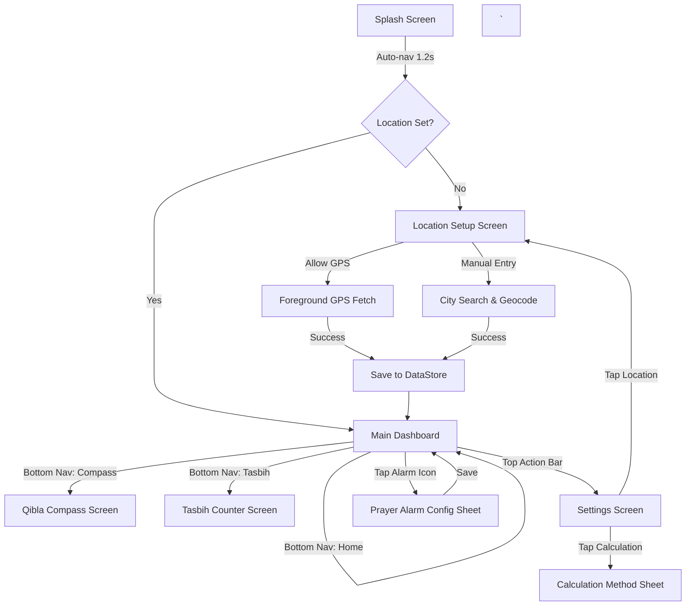

# 03. Functional Flows & Navigation — Prayer Time Helper
`
This document maps the user navigation flow, state transitions, and UI interaction gates for Prayer Time Helper.
`
---
`
## 1. Screen Transitions Diagram
`

`
---
`
## 2. Bottom Navigation Architecture
`
| Index | Label | Icon | Destination |
| :--- | :--- | :--- | :--- |
| 0 | **Timings** | `Icons.Rounded.Schedule` | Main Dashboard (Daily Times & Countdown) |
| 1 | **Qibla** | `Icons.Rounded.Explore` | Qibla Compass |
| 2 | **Tasbih** | `Icons.Rounded.ControlPoint` | Digital Dhikr Counter |
`
---
`
## 3. Key User Journeys
`
### 3.1 First Launch & Location Setup (Crucial for Privacy Policy)
1.  User opens app. Splash screen shows.
2.  App checks DataStore for saved coordinates. If missing, routes to `SetupLocation`.
3.  **Setup Screen**: Displays a clear, prominent disclosure: *"Prayer Time Helper needs your location to calculate accurate prayer times and Qibla direction. Your location is only fetched once and never sent to our servers."*
4.  User taps **"Use Current Location"**:
    *   System permission prompt (`ACCESS_COARSE_LOCATION` / `ACCESS_FINE_LOCATION`) appears.
    *   User grants permission. App fetches location (foreground only), saves lat/long to DataStore, and navigates to Dashboard.
5.  OR User taps **"Enter City Manually"**:
    *   Search bar appears. User types "Dhaka".
    *   One-time Geocoding API call fetches Dhaka's coordinates. Saved to DataStore. No GPS permission requested.
`
### 3.2 Daily Usage (Zero Friction)
1.  User opens app.
2.  `DashboardViewModel` reads location from DataStore.
3.  Triggers `Adhan` library to calculate today's timings using the location.
4.  Dashboard immediately displays the countdown to the next prayer.
5.  *Total time: < 500ms (completely offline).*
`
### 3.3 Qibla Compass Calibration & Usage
1.  User navigates to the **Qibla** tab.
2.  App checks if the device has a magnetometer. If no, displays error state: "Device does not support compass."
3.  If yes, registers sensor listeners.
4.  If sensor accuracy is `SENSOR_STATUS_UNRELIABLE`, an overlay prompts the user to "Calibrate Compass" by drawing a figure-8 motion with the phone.
5.  Once reliable, the compass dial rotates. The needle points to the calculated Qibla bearing.
`
### 3.4 Setting a Prayer Alarm
1.  On the Dashboard, user taps the bell icon next to "Fajr".
2.  Bottom sheet slides up with options: "Silent", "Notification Only", "Full Azan".
3.  User selects "Full Azan".
4.  App schedules an `AlarmManager` exact alarm for the calculated Fajr time.
5.  If Android 13+, app requests `POST_NOTIFICATIONS` permission if not already granted.
6.  If Android 12+, app requests `SCHEDULE_EXACT_ALARM` permission.
`
---
`
## 4. State Management Rules
`
### 4.1 Midnight Date Rollover
*   The `DashboardViewModel` must listen for `Intent.ACTION_TIME_TICK` or `Intent.ACTION_DATE_CHANGED` via a BroadcastReceiver.
*   When the date crosses midnight, the ViewModel automatically recalculates the timings for the new day without requiring an app restart.
`
### 4.2 Offline Architecture Guarantee
*   The Geocoding API (for manual city search) is the **only** network call in the core functional flow.
*   Once coordinates are saved, the device can remain in Airplane Mode indefinitely; the `Adhan` library handles all future calculations mathematically.
`