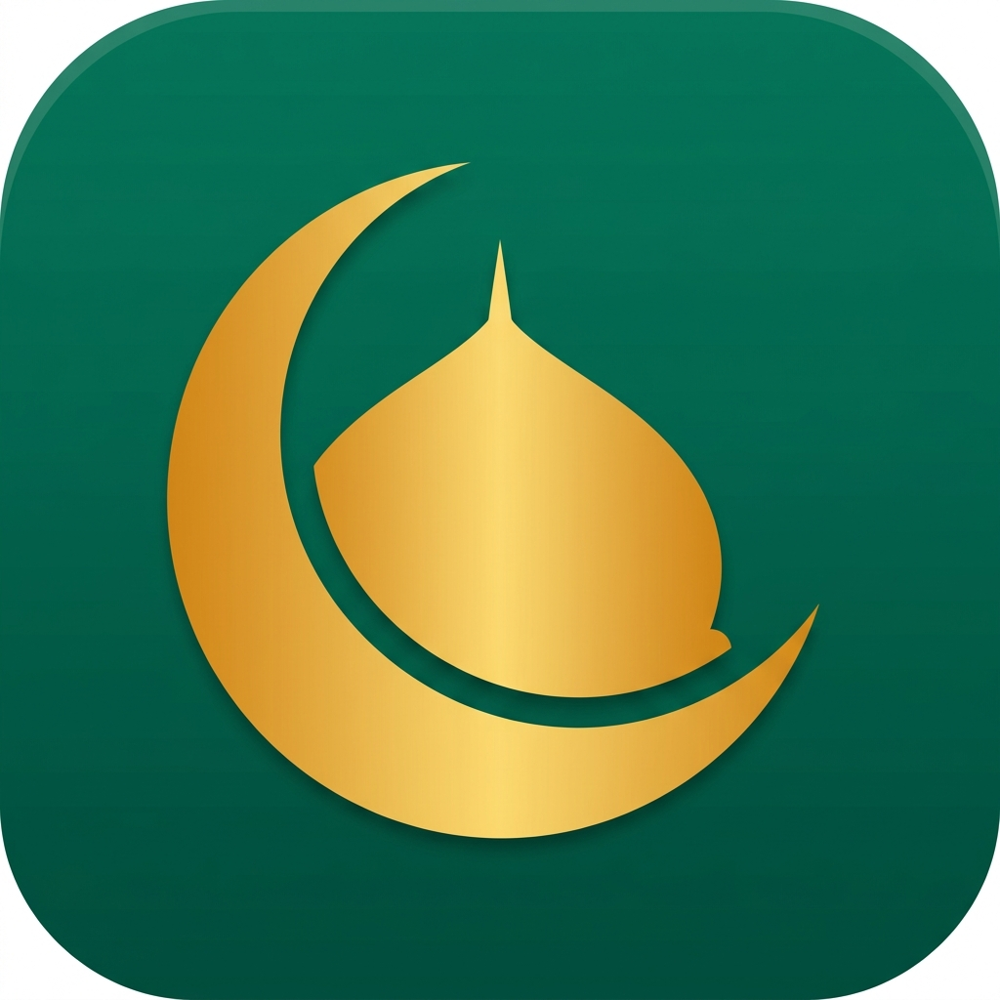

# Prayer Time Helper — Master Index
`
Welcome to the design and development blueprint directory for **Prayer Time Helper**. This is a documentation-first repository designed to instruct human developers or AI agents on building this application from scratch.
`
---
`
## 🎯 App Overview
`
| Attribute | Value |
| :--- | :--- |
| **App Name** | Prayer Time Helper |
| **Package** | `com.saviorsystems.prayertimehelper` |
| **Category** | Lifestyle / Religion |
| **Architecture** | Clean MVVM + Jetpack Compose + Room + Adhan Kotlin |
| **Privacy Model** | 100% Offline Calculation, Zero Background Location |
| **Primary Color** | `#00695C` (Deep Emerald Green) |
| **Secondary Color** | `#1565C0` (Midnight Blue) |
| **Target Keywords** | prayer time, qibla finder, namaz time bangladesh, azan alarm |
`
---
`
## 📂 Documentation Directory Map
`
Click on any of the sections below to navigate to the specific blueprint:
`
| # | Document | Description |
| :--- | :--- | :--- |
| 01 | [PRD-REQUIREMENTS.md](01.PRD-REQUIREMENTS.md) | Feature list, personas, and success metrics (focus on South Asia). |
| 02 | [UI-UX-DESIGN-SYSTEM.md](02.UI-UX-DESIGN-SYSTEM.md) | Emerald/Midnight palette, Outfit font, compass animations. |
| 03 | [FUNCTIONAL-FLOWS.md](03.FUNCTIONAL-FLOWS.md) | Location setup gate, compass calibration, midnight rollover state. |
| 04 | [TECHNICAL-ARCHITECTURE.md](04.TECHNICAL-ARCHITECTURE.md) | MVVM tree, Adhan library engine, AlarmManager background reliability. |
| 05 | [DATABASE-SCHEMA.md](05.DATABASE-SCHEMA.md) | Room cache for timings, DataStore for calculation methods. |
| 06 | [ADMOB-MONETIZATION-MAP.md](06.ADMOB-MONETIZATION-MAP.md) | Banner placements, strict 4-hour interstitial cap, zero-ad zones. |
| 07 | [ASO-PLAY-STORE-LISTING.md](07.ASO-PLAY-STORE-LISTING.md) | Store title, full description, keyword matrix, and screenshot specs. |
| 08 | [PLAY-POLICY-SAFETY.md](08.PLAY-POLICY-SAFETY.md) | Permissions audit, background location avoidance, Data Safety form. |
| 09 | [TESTING-ASSURANCE-PLAN.md](09.TESTING-ASSURANCE-PLAN.md) | Unit tests for calculation, compass sensor tests, Doze mode QA. |
| 10 | [TRANSLATIONS-LOCALIZATION.md](10.TRANSLATIONS-LOCALIZATION.md) | Base strings.xml, Bengali/Hindi/Urdu targets, RTL rules. |
| 11 | [GRAPHIC-ASSETS-MANIFEST.md](11.GRAPHIC-ASSETS-MANIFEST.md) | Icon specs, screenshot designs, and feature graphic blueprint. |
| 12 | [LOGGING-ANALYTICS.md](12.LOGGING-ANALYTICS.md) | Custom Firebase events, screen tracking, strict PII-free rules. |
| 13 | [BACKLOG-TASKS.md](13.BACKLOG-TASKS.md) | Phased development backlog across 7 phases + V2 enhancements. |
`
---
`
## 🖼️ App Icon
`

`
---
`
## 🔑 Key Differentiators
`
| Feature | Description |
| :--- | :--- |
| **Offline Calculation** | Timings generated via math (`Adhan` library) rather than APIs. |
| **Zero Background Location** | Location fetched once on setup or entered manually, preserving privacy. |
| **Sensor-Fused Compass** | Low-Pass Filtered magnetometer + accelerometer for smooth Qibla pointing. |
| **South Asia Optimized** | Defaults to Karachi calculation method and Hanafi Asr shadows. |
| **Reliable Alarms** | `AlarmManager.setExactAndAllowWhileIdle` ensures Azan plays even in Doze mode. |
| **Respectful Ads** | Interstitials capped at 4 hours. No ads during active prayer countdowns or compass use. |
`
---
`
## ☁️ GCP & Firebase API Setup & SOP
`
### 1. Required Cloud API Category
- **Category:** Level 1 (Telemetry & Monetization)
- **Core APIs:** `firebaseanalytics.googleapis.com`, `crashlytics.googleapis.com`, `admob.googleapis.com`
- **SOP Implementation:** Firebase for tracking setup drop-offs, Crashlytics for monitoring sensor failures, AdMob for non-intrusive revenue.
`
### 2. Credentials & Config Mapping
- Place the downloaded `google-services.json` config inside the `app/` directory.
- Production AdMob Unit IDs are stored in `local.properties` and injected via `buildConfigField`.
- Production credentials are dynamically configured on launch.
`
### 3. Firebase Project
- **Project ID:** `hopeful-breaker-426606-h9`
- **App ID:** Registered in Firebase Console under the Savior Systems portfolio.
`
---
`
## 📊 Status
`
**Documentation**: ✅ Complete (14/14 files)  
**Assets**: ✅ App icon generated  
**Phase**: Ready for Phase 1 scaffolding  
**Last Updated**: June 2026
`