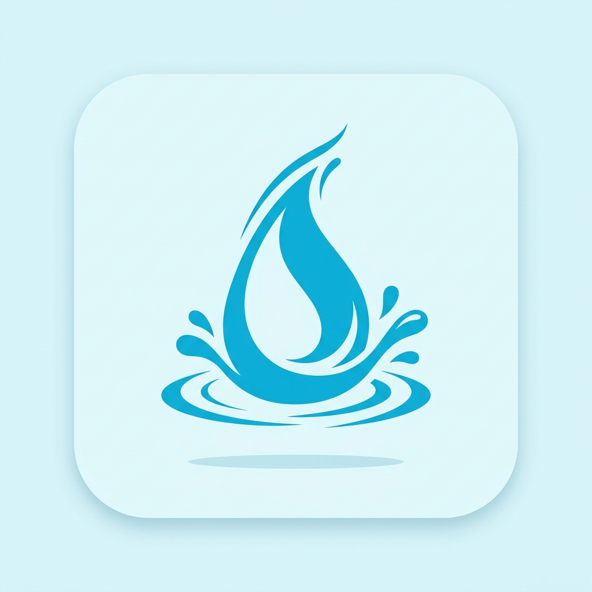

# Water Log & Remind — Master Index
```
Welcome to the design and development blueprint directory for **Water Log & Remind**. This is a documentation-first repository designed to instruct human developers or AI agents on building this application from scratch.
```
---
```
## 🎯 App Overview
```
| Attribute | Value |
| :--- | :--- |
| **App Name** | Water Tracker & Reminder |
| **Package** | `com.saviorsystems.waterlogremind` |
| **Category** | Health & Fitness |
| **Architecture** | Clean MVVM + Jetpack Compose + Room + Jetpack Glance |
| **Privacy Model** | 100% Offline, Zero Cloud Sync, Local DataStore only |
| **Primary Color** | `#0288D1` (Clear Ocean Blue) |
| **Secondary Color** | `#0097A7` (Teal / Cyan) |
| **Target Keywords** | water tracker, drink water reminder, hydration app, water widget |
```
---
```
## 📂 Documentation Directory Map
```
Click on any of the sections below to navigate to the specific blueprint:
```
| # | Document | Description |
| :--- | :--- | :--- |
| 01 | [PRD-REQUIREMENTS.md](01.PRD-REQUIREMENTS.md) | Smart goals, widget-first logging, interval reminders, and KPIs. |
| 02 | [UI-UX-DESIGN-SYSTEM.md](02.UI-UX-DESIGN-SYSTEM.md) | Aqua Blue palette, rounded typography, and fluid wave animations. |
| 03 | [FUNCTIONAL-FLOWS.md](03.FUNCTIONAL-FLOWS.md) | Goal onboarding, Glance widget architecture, and streak reset logic. |
| 04 | [TECHNICAL-ARCHITECTURE.md](04.TECHNICAL-ARCHITECTURE.md) | MVVM tree, Goal Calculator logic, dual WorkManager/AlarmManager strategy. |
| 05 | [DATABASE-SCHEMA.md](05.DATABASE-SCHEMA.md) | Room tables for intake logs, DataStore for user profile and quiet hours. |
| 06 | [ADMOB-MONETIZATION-MAP.md](06.ADMOB-MONETIZATION-MAP.md) | Passive banners, gated interstitials avoiding micro-interaction disruption. |
| 07 | [ASO-PLAY-STORE-LISTING.md](07.ASO-PLAY-STORE-LISTING.md) | Store title, full description, and keyword matrix optimized for Tier-1. |
| 08 | [PLAY-POLICY-SAFETY.md](08.PLAY-POLICY-SAFETY.md) | Health App declarations, Data Safety form, and Alarm permission rationale. |
| 09 | [TESTING-ASSURANCE-PLAN.md](09.TESTING-ASSURANCE-PLAN.md) | Unit tests for goal calculators, Jetpack Glance widget testing, Doze mode QA. |
| 10 | [TRANSLATIONS-LOCALIZATION.md](10.TRANSLATIONS-LOCALIZATION.md) | Base strings.xml, EU targets (ES/FR/DE), logic for ML to OZ conversions. |
| 11 | [GRAPHIC-ASSETS-MANIFEST.md](11.GRAPHIC-ASSETS-MANIFEST.md) | Icon specs, widget-focused screenshots, and onboarding illustrations. |
| 12 | [LOGGING-ANALYTICS.md](12.LOGGING-ANALYTICS.md) | Widget vs in-app usage events, strict rules avoiding exact weight/gender data. |
| 13 | [BACKLOG-TASKS.md](13.BACKLOG-TASKS.md) | Phased development backlog from Room setup to Widget integration. |
```
---
```
## 🖼️ App Icon
```

```
---
```
## 🔑 Key Differentiators
```
| Feature | Description |
| :--- | :--- |
| **Widget-First Logging** | Users log intake directly from the home screen using Jetpack Glance widgets. |
| **Fluid UI Animations** | A beautiful, reactive sine-wave animation that physically fills the screen as users log water. |
| **Smart Hydration Engine** | Calculates precise ml goals based on weight, gender, activity level, and climate. |
| **Beverage Multipliers** | Accurately tracks hydration across Coffee, Tea, and Juice, not just plain water. |
| **Respectful Reminders** | Interval-based notifications that automatically pause during user-defined "Sleep Hours". |
| **Zero Account Wall** | 100% offline and private. No sign-up required to use the app. |
```
---
```
## ☁️ GCP & Firebase API Setup & SOP
```
### 1. Required Cloud API Category
- **Category:** Level 1 (Telemetry & Monetization)
- **Core APIs:** `firebaseanalytics.googleapis.com`, `crashlytics.googleapis.com`, `admob.googleapis.com`
- **SOP Implementation:** Firebase for tracking widget vs. app engagement, Crashlytics for background widget stability, AdMob for non-intrusive revenue.
```
### 2. Credentials & Config Mapping
- Place the downloaded `google-services.json` config inside the `app/` directory.
- Production AdMob Unit IDs are stored in `local.properties`.
```
### 3. Firebase Project
- **Project ID:** `hopeful-breaker-426606-h9`
- **App ID:** Registered in Firebase Console under the Savior Systems portfolio.
```
---
```
## 📊 Status
```
**Documentation**: ✅ Complete (14/14 files)  
**Assets**: ✅ App icon generated  
**Phase**: Ready for Phase 1 scaffolding  
**Last Updated**: June 2026
```