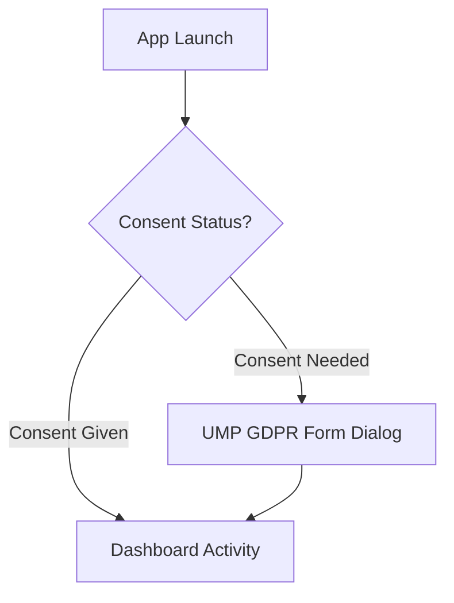

# 03. Functional Flows — Smart Age & BD Date
```
This document maps out screen layouts, user navigation, and edge case flows for the application.
```
---
```
## 1. User Navigation Flow
```

    D --> E[Tab 1: Age Calculator]
    D --> F[Tab 2: Date Difference]
    D --> G[Tab 3: Birthday Registry]
```
    E --> E1[Select DOB & Target Date]
    E1 --> E2[Calculate Age]
    E2 --> E3[Detailed Results Sheet / Cooldown Interstitial]
```
    F --> F1[Select Date A & Date B]
    F1 --> F2[Calculate Gap]
    F2 --> F3[Days/Weeks/Months Difference View]
```
    G --> G1{Profiles Exist?}
    G1 -->|No| G2[Empty State: Empty Registry Screen]
    G1 -->|Yes| G3[Upcoming Birthdays List]
    G3 --> G4[Click Profile]
    G4 --> G5[Birthday Countdown detail screen]
    G2 --> G6[Click Add Profile FAB]
    G3 --> G6
    G6 --> G7[Add Profile Form DOB / Name / Avatar]
    G7 --> G8[Save Profile to Room & Schedule Alarm]
    G8 --> G3
```
```
---
```
## 2. State & Edge Case Handling
```
### Edge Case A: Inverted Dates
*   **Trigger**: The user inputs a Target Date that is earlier than their DOB (e.g., DOB: 2000, Target: 1990).
*   **Behavior**: Display a localized error banner: *"Target Date must be after Date of Birth"*. The "Calculate" button is disabled until valid dates are selected.
```
### Edge Case B: Empty Birthday Registry
*   **Trigger**: Opening Tab 3 with no profiles stored in Room.
*   **Behavior**: Display a custom illustration of a calendar, a premium text block: *"Never miss a special day. Add your first friend's birthday"*, and a prominent pulse-animated Floating Action Button (FAB).
```
### Edge Case C: Leap Year Birthdays (February 29)
*   **Trigger**: Saving a profile with a birth date of Feb 29.
*   **Behavior**: If the upcoming year is not a leap year, schedule the `AlarmManager` alert to fire on **February 28** at 09:00 AM. In the database representation, the original Feb 29 date is preserved, but the next alarm timestamp is mathematically shifted.
```