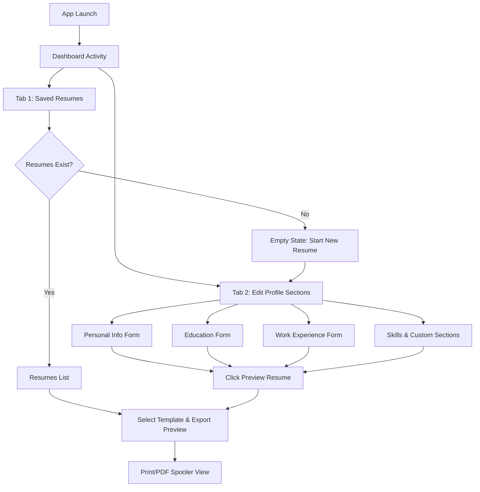

# 03. Functional Flows — Resume PDF Maker

Screen navigation transitions, forms management, and validation edge cases.

---

## 1. User Navigation Flow

---

## 2. State & Edge Case Handling

### Edge Case A: Empty Input Validations
*   **Trigger**: Clicking "Preview Resume" with no personal details (Name/Email) filled in.
*   **Behavior**: Highlight the missing required fields in Crimson Red and show a localized toast: *"Please enter at least your Name and Email to preview."*

### Edge Case B: Empty List States
*   **Trigger**: Opening the Resume list with zero profiles stored.
*   **Behavior**: Render a minimalist graphic depicting a blank resume sheet, clean copy: *"Create your professional resume in minutes. Let's get started"*, and an active FAB button labeled *"New Profile"*.

### Edge Case C: Text Overflow in PDF Canvas
*   **Trigger**: Long sentences in Experience description leading to PDF page overflowing.
*   **Behavior**: The HTML template CSS enforces page-break properties (`page-break-inside: avoid;`) to prevent text from splitting awkwardly across sheets.
