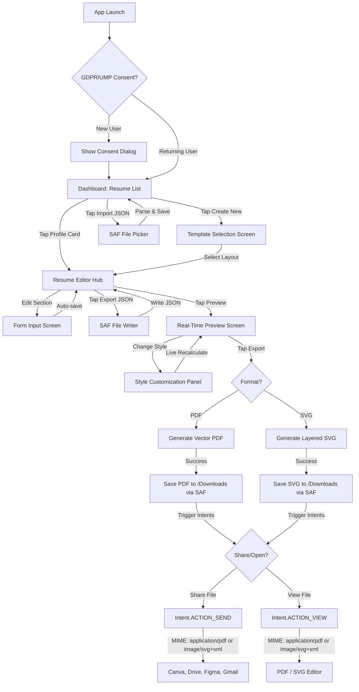

# 03. Functional Flows & Navigation

## 1. Overall App Flowchart

This diagram outlines the complete screen transitions, navigation stack, and external integration points:



---

## 2. Transition Points & System Integration
1. **Zero-Permission PDF & SVG Export:**
   * User taps "Export Document" and selects either **Vector PDF** or **Layered SVG**.
   * The app generates the corresponding vector layout and uses the **Storage Access Framework (SAF)** to request a destination (or saves directly to `/Downloads` using `MediaStore` APIs).
   * Once saved, the app retrieves the document's file URI via `FileProvider`.
2. **External App Integration (Canva / Adobe Reader / Illustrator / Figma):**
   * **Open Intent (`ACTION_VIEW`):**
     ```kotlin
     val mimeType = if (isSvg) "image/svg+xml" else "application/pdf"
     val intent = Intent(Intent.ACTION_VIEW).apply {
         setDataAndType(documentUri, mimeType)
         flags = Intent.FLAG_GRANT_READ_URI_PERMISSION or Intent.FLAG_ACTIVITY_NO_HISTORY
     }
     context.startActivity(Intent.createChooser(intent, "Open with (Canva, Drive, etc.)"))
     ```
     This triggers the Android system chooser, listing all compatible graphic editors and productivity tools (including Canva, Adobe Acrobat, and Google Drive).
   * **Share Intent (`ACTION_SEND`):**
     ```kotlin
     val mimeType = if (isSvg) "image/svg+xml" else "application/pdf"
     val shareIntent = Intent(Intent.ACTION_SEND).apply {
         type = mimeType
         putExtra(Intent.EXTRA_STREAM, documentUri)
         flags = Intent.FLAG_GRANT_READ_URI_PERMISSION
     }
     context.startActivity(Intent.createChooser(shareIntent, "Share Resume..."))
     ```
3. **Local JSON Backup (Import/Export):**
   * **Export:** Serializes the `ResumeWithDetails` object to JSON using Gson/Kotlinx.Serialization and launches `CREATE_DOCUMENT` to let the user save the file as `my_resume_backup.json`.
   * **Import:** Launches `GET_CONTENT` with MIME type `application/json`. When selected, the app parses the JSON content, validates fields, and inserts it into Room as a new resume profile.
4. **Real-time Canvas Rendering:**
   * Tapping tabs or toggling margins recalculates text size/line height coordinates instantly, updating the Compose `Canvas` view to provide immediate visual layout feedback.
