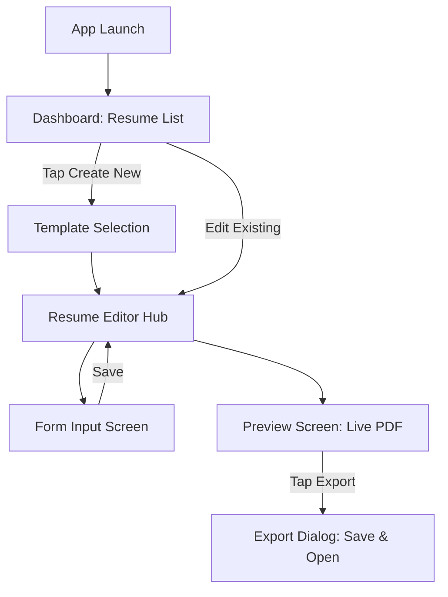

# 03. Functional Flows & Navigation

## 1. Overall App Flowchart
This is the journey the user takes through the app.

## 2. Step-by-Step Flow Instructions for Dev
1. **Dashboard:** Fetch `List<ResumeEntity>` from Room. If empty, show "Create your first resume" illustration.
2. **Editor Hub:** Pass the `resumeId` via Navigation Arguments to the Hub. The Hub fetches the relations (Edu, Exp) to calculate completion percentage.
3. **Form Input:** Forms must map cleanly to state classes.
4. **Preview:** Do not generate the physical PDF file continuously. Draw the layout to a Compose `Canvas` for preview, and only use `PdfDocument` for final export to save memory.
