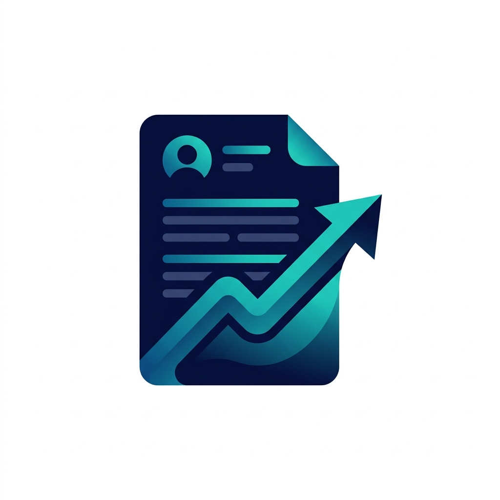

# 11. Graphic Assets Manifest — Resume PDF Maker
```
Design manifest for launcher icons and store listing screenshot elements.
```
---
```
## 1. App Icon Showcase
```

```
---
```
## 2. Adaptive Icon Layout Specifications
```
Built to support Material 3 dynamic styling and adaptive cropping:
*   **Background Layer (`res/drawable/ic_launcher_background.xml`)**: Solid hex `#1A237E` (Corporate Navy) with a clean grid watermark.
*   **Foreground Layer (`res/drawable/ic_launcher_foreground.xml`)**: Vector layout showing a stylized document folder overlapping a professional certificate or badge in white and steel-blue accents.
*   **Monochrome Layer (`res/drawable/ic_launcher_monochrome.xml`)**: Simplified vector path enabling system-wide dynamic theme coloring.
```
---
```
## 3. Play Store Screenshots Wireframe
1.  **Frame 1 (Editor)**: Screenshot of the profile builder edit forms. Caption: *Fill in your credentials easily*.
2.  **Frame 2 (Templates)**: Screen showcasing the horizontal template selection slider. Caption: *Choose from professional layouts*.
3.  **Frame 3 (Preview)**: Full render view of the CV before print. Caption: *Review layouts in real-time*.
4.  **Frame 4 (PDF Print)**: Hand-off to the system print manager page. Caption: *Export to A4 PDF instantly*.
```