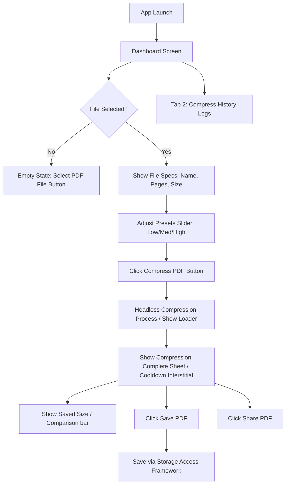

# 03. Functional Flows — PDF Compress Lite

Detailed user flows, navigation screens, and compression state transitions.

---

## 1. User Navigation Flow

---

## 2. State & Edge Case Handling

### Edge Case A: Encrypted / Password-Protected PDF
*   **Trigger**: Importing a password-locked PDF.
*   **Behavior**: Disable the compression slider, show a warning card in Crimson Red: *"This document is password protected and cannot be modified. Please unlock it before importing."*

### Edge Case B: Double Compression Attempt
*   **Trigger**: User attempts to compress a file that is already heavily optimized.
*   **Behavior**: If the compressed output size is larger than or equal to the original size, halt export and alert the user: *"This file is already highly optimized. Further compression would compromise readability."*

### Edge Case C: File Access Revocation
*   **Trigger**: Android system revokes temporary URI access permissions during processing.
*   **Behavior**: Catch the security exception, abort the loader cleanly, and present a dialog: *"Unable to access source file. Please select the document again."*
