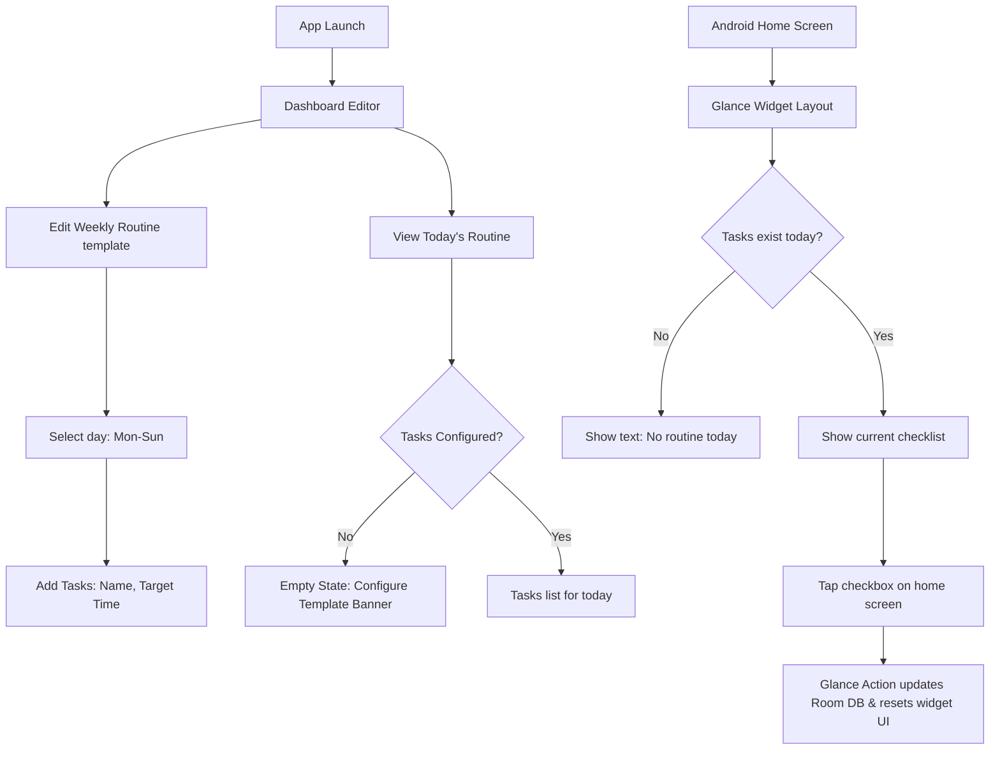

# 03. Functional Flows — Routine Widget

Interactions, state flows, and sync structures for widgets and apps.

---

## 1. User Navigation Flow

---

## 2. State & Edge Case Handling

### Edge Case A: Midnight Date Rollover
*   **Trigger**: The device clock passes 00:00 midnight while the widget is visible.
*   **Behavior**: A periodic worker or broadcast receiver listener detects date changes, archives the previous day's checklist stats in Room, resets checked boxes, and refreshes the widget with the current day's new template.

### Edge Case B: Empty Widget State
*   **Trigger**: The user places the widget on the home screen but has not configured any routines.
*   **Behavior**: The widget renders a text field: *"Tap here to add tasks"* that deep-links directly to the app's configuration editor on click.

### Edge Case C: App Widget Host Limits
*   **Trigger**: User places multiple instances of the Routine Widget.
*   **Behavior**: The Glance framework manages layout refreshes across all widget instances by calling `RoutineWidget().updateAll(context)` upon database modifications.
