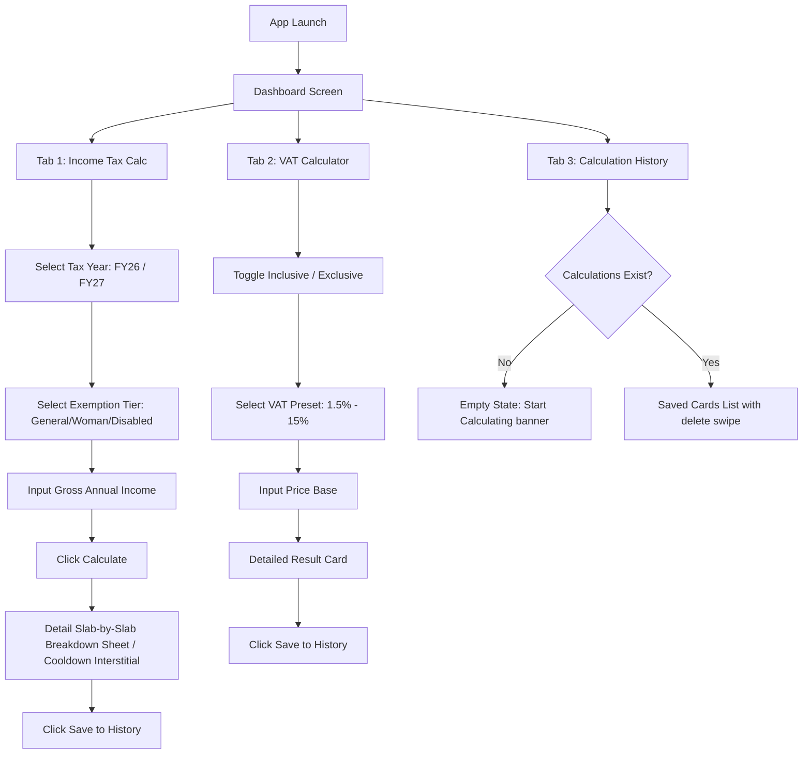

# 03. Functional Flows — BD Tax & VAT Calc

Navigation transitions, user inputs validations, and financial logic flows.

---

## 1. User Navigation Flow

---

## 2. State & Edge Case Handling

### Edge Case A: Income Lower Than Tax-Free Threshold
*   **Trigger**: Taxable income is less than or equal to the selected category threshold (e.g., BDT 300,000 for General).
*   **Behavior**: Set Tax Payable to BDT 0. Display a positive banner in Forest Green: *"Your income falls within the tax-free limit. Tax Payable: 0 BDT"*.

### Edge Case B: Minimum Tax Rules Override
*   **Trigger**: Taxable income exceeds threshold, but the mathematically calculated progressive tax is below the geographical minimum (e.g., BDT 5,000 for Dhaka).
*   **Behavior**: Display a warning alert: *"Calculated tax is lower than local minimum. Minimum Tax of 5,000 BDT applies."* Apply BDT 5,000 as final tax payable.

### Edge Case C: July 2026 Budget Switch
*   **Trigger**: User changes the Tax Year dropdown.
*   **Behavior**: The ViewModel instantly re-loads the respective JSON array mapping for the selected fiscal year (e.g. updating General limit from BDT 375,000 to new July budget rates), clearing the current output card to trigger a re-calculation.
