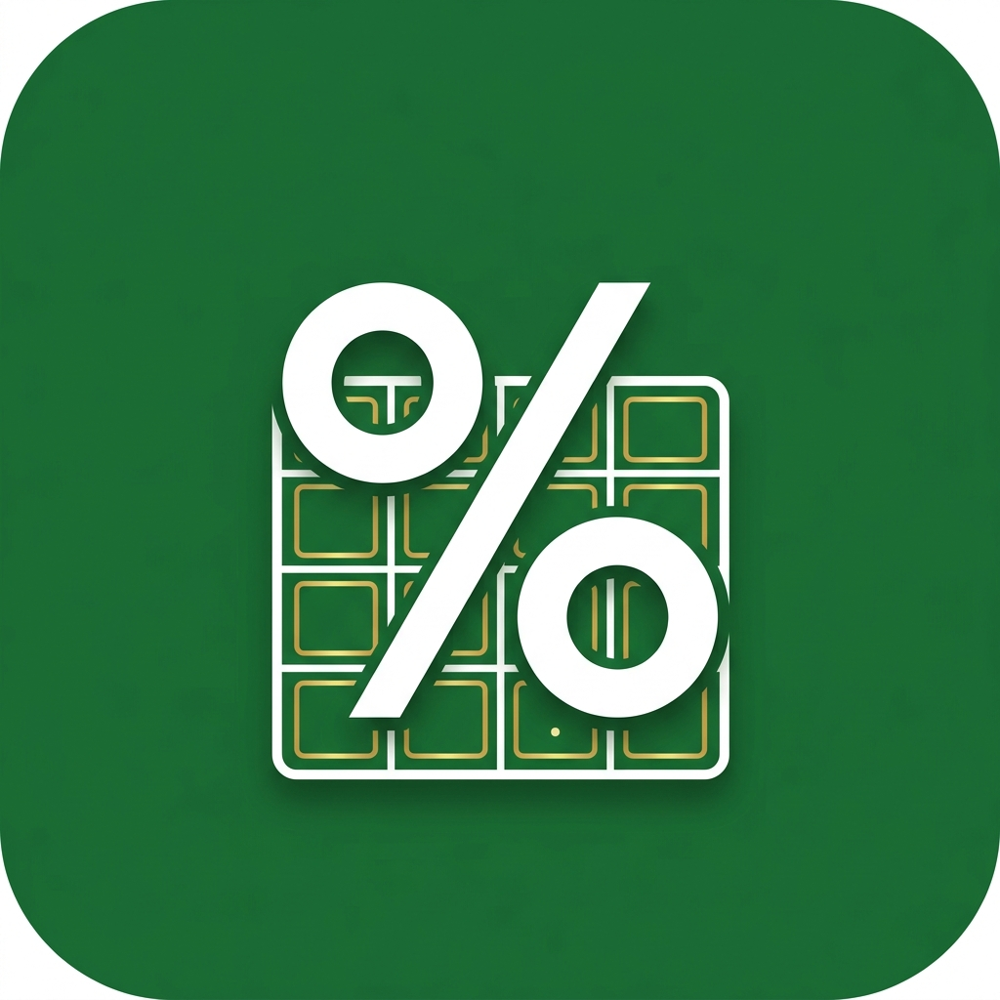

# 11. Graphic Assets Manifest — BD Tax & VAT Calc

Adaptive launcher icon vector structures and App Store screenshot descriptions.

---

## 1. App Icon Showcase

---

## 2. Adaptive Icon Vector Structure

Compatible with Material 3 dynamic color-shifting templates:
*   **Background Layer (`res/drawable/ic_launcher_background.xml`)**: Solid hex `#2E7D32` (Forest Green) background with a fine money grid layout.
*   **Foreground Layer (`res/drawable/ic_launcher_foreground.xml`)**: Vector layout showing a modern percentage logo (%) overlapping a calculator terminal grid in white and golden-yellow accents.
*   **Monochrome Layer (`res/drawable/ic_launcher_monochrome.xml`)**: Simplistic vector path enabling dynamic theme coloring matching the Android Launcher.

---

## 3. Play Store Screenshot Map
1.  **Frame 1 (Tax Calculator)**: Main tax input screen showing progressive slab selectors. Title: *Calculate Progressive Tax Slabs*.
2.  **Frame 2 (Tax Result)**: Shows calculations details (slabs percentages, total payable, and warnings). Title: *Get Detailed Slab Breakdowns*.
3.  **Frame 3 (VAT Calculator)**: Toggle VAT settings and percentage presets. Title: *Quick VAT Inclusive/Exclusive*.
4.  **Frame 4 (History)**: List of saved calculation audits. Title: *Save & Compare Calculations*.
