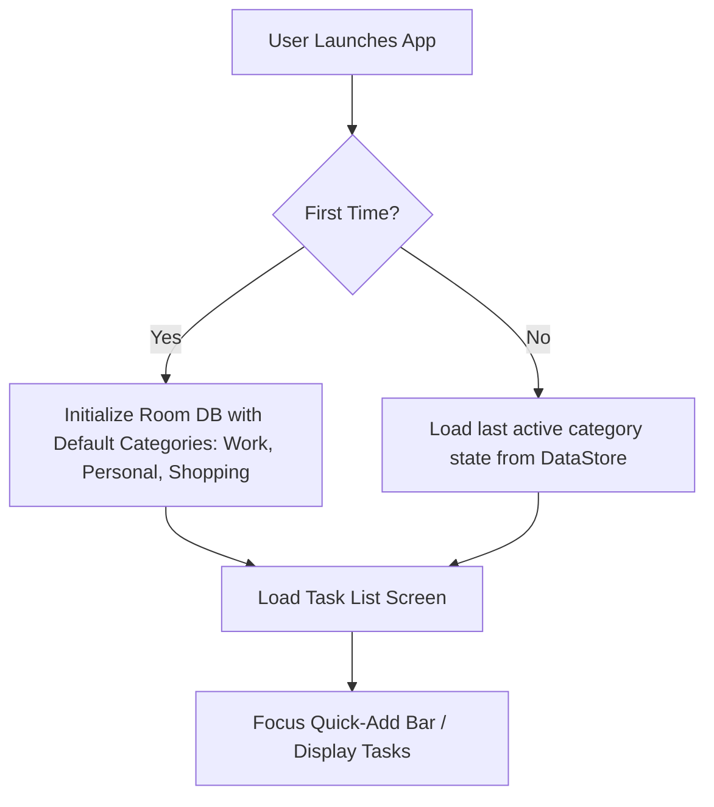
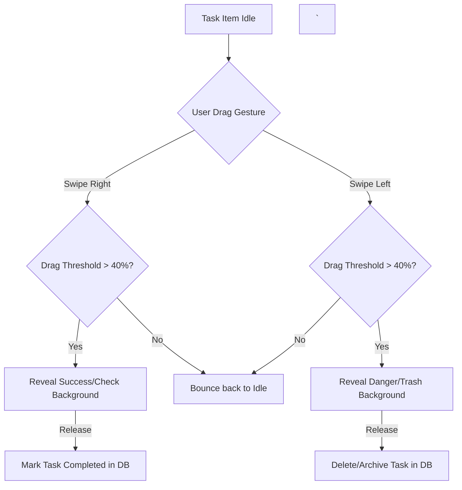

# 03. Functional Flows
`
This document details the flow diagrams and step-by-step user interactions for the **Minimalist To-Do** app.
`
---
`
## 1. App Launch & Initialization Flow

`
---
`
## 2. Fast-Capture Task Entry Flow
*   **Trigger**: User taps the anchored input bar at the bottom.
*   **Key Design Goal**: Under 5 seconds from thought to saved task.
`
```mermaid
sequenceDiagram
    participant User
    participant MainScreen
    participant QuickAddBar
    participant RoomDB
`
    User->>MainScreen: Open App / Tap Quick-Add
    MainScreen->>QuickAddBar: Focus keyboard & show input cursor
    User->>QuickAddBar: Type "Pick up parcel"
    User->>QuickAddBar: Press Enter or Tap "Send"
    QuickAddBar->>RoomDB: Insert Task(title="Pick up parcel", status=ACTIVE)
    RoomDB-->>MainScreen: Emit updated Flow list
    MainScreen->>User: Play gentle vibration & append task to top of list
```
`
---
`
## 3. Swipe-to-Action Gestures Flow
The task list item responds dynamically to lateral swipe drag gestures.
`

`
---
`
## 4. Navigation & Screen Transitions Map
The application uses a clean single-activity structure, with small overlays for minor configurations to prevent loss of focus.
`
*   **Main Screen (List View)**:
    *   Top: Category Chips (horizontal scroll) + Settings Gear Icon.
    *   Center: Task List with Swipe Actions. If list is empty, display a clean minimalist vector icon and the caption "No tasks for today. Start fresh!".
    *   Bottom: Anchored Quick-Add TextField with category selector tag.
*   **Settings Dialog/Screen (Slide up)**:
    *   Trigger: Settings Gear tapped from Main Screen.
    *   Options: Theme (Light/Dark/System), Clean Completed Tasks, Backup Data, Restore Data, About / Privacy Policy.
    *   Exit: Interstitial ad triggered upon exiting settings back to Main Screen, only if the **180s cooldown timer** has elapsed.
`
---
`
## Next Steps
*   To review the architectural details, class responsibilities, and ViewModel structures, see [04.TECHNICAL-ARCHITECTURE.md](04.TECHNICAL-ARCHITECTURE.md).
`