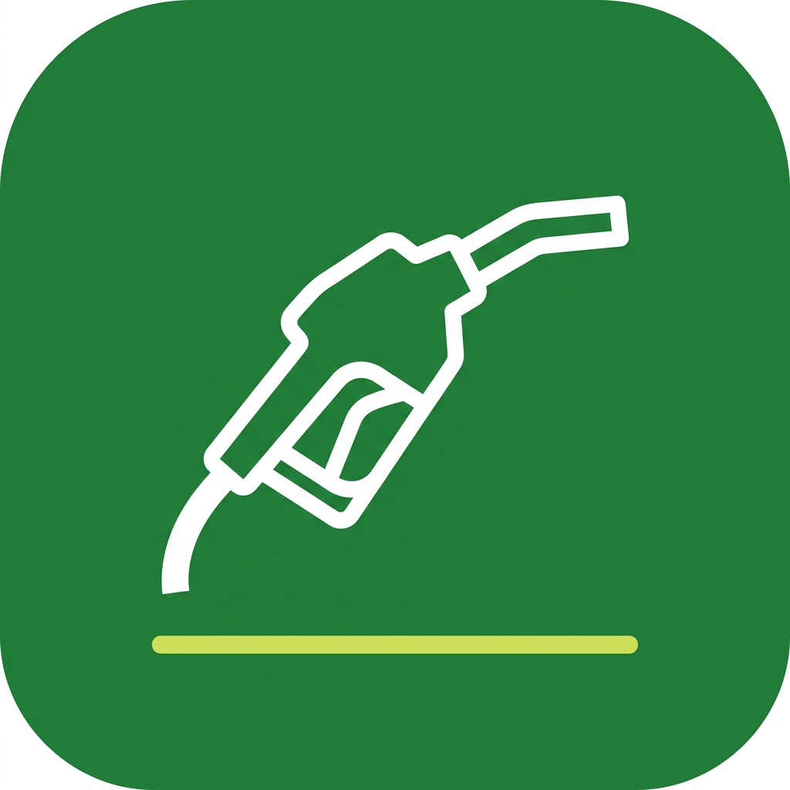

# Fuel Mileage Log — Master Index
```

```
Welcome to the development blueprint directory for **Fuel Mileage Log**.
```
---
```
## 📂 Documentation Directory Map
*   [01.PRD-REQUIREMENTS.md](01.PRD-REQUIREMENTS.md) — Personas, features, and zero-ad zones.
*   [02.UI-UX-DESIGN-SYSTEM.md](02.UI-UX-DESIGN-SYSTEM.md) — Emerald Green styling, typography, and fonts.
*   [03.FUNCTIONAL-FLOWS.md](03.FUNCTIONAL-FLOWS.md) — Quick fuel logging transitions and diagrams.
*   [04.TECHNICAL-ARCHITECTURE.md](04.TECHNICAL-ARCHITECTURE.md) — ViewModels and efficiency calculation code.
*   [05.DATABASE-SCHEMA.md](05.DATABASE-SCHEMA.md) — SQLite fuel purchase log schemas.
*   [06.ADMOB-MONETIZATION-MAP.md](06.ADMOB-MONETIZATION-MAP.md) — Placements and the 180s cooldown helper.
*   [07.ASO-PLAY-STORE-LISTING.md](07.ASO-PLAY-STORE-LISTING.md) — Descriptions and optimized search keywords.
*   [08.PLAY-POLICY-SAFETY.md](08.PLAY-POLICY-SAFETY.md) — Permission checks and data safety questionnaire.
*   [09.TESTING-ASSURANCE-PLAN.md](09.TESTING-ASSURANCE-PLAN.md) — Automated math test suites and QA logs.
*   [10.TRANSLATIONS-LOCALIZATION.md](10.TRANSLATIONS-LOCALIZATION.md) — Localized strings XML structures.
*   [11.GRAPHIC-ASSETS-MANIFEST.md](11.GRAPHIC-ASSETS-MANIFEST.md) — Asset sizing and store listing details.
*   [12.LOGGING-ANALYTICS.md](12.LOGGING-ANALYTICS.md) — Non-PII Firebase tracking guidelines.
*   [13.BACKLOG-TASKS.md](13.BACKLOG-TASKS.md) — The task checklists for code building.
```
---
```
## ☁️ GCP & Firebase API Setup & SOP
*   **Category**: Level 1 (Telemetry, UMP Consent, and AdMob)
*   **Core APIs**: `firebase.googleapis.com` (Free Tier)
*   **SOP**: Link standard converter analytics, load app configurations, and mapping configs to Android source build directories.
```