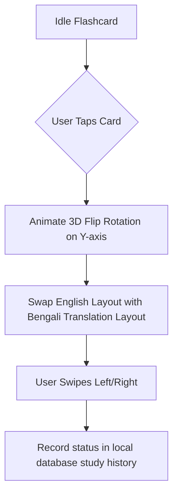

# 03. Functional Flows
```
This document outlines screen flow charts for **English-Bangla Vocab**.
```
---
```
## 1. Dictionary Lookup Flow
```mermaid
```sequenceDiagram
    participant User
    participant SearchBar
    participant RoomDB
    participant DefinitionView
```
    User->>SearchBar: Type "persistent"
    SearchBar->>RoomDB: Query "SELECT * FROM words WHERE english LIKE 'persistent%'"
    RoomDB-->>SearchBar: Emit matching WordEntity records
    SearchBar->>User: Display autocompletion list
    User->>SearchBar: Select item from list
    SearchBar->>DefinitionView: Display card (English, Bangla translation, synonyms)
```
```
---
```
## 2. Flashcard Flip Interaction Flow

```
---
```
## Next Steps
*   To review the MVVM classes, see [04.TECHNICAL-ARCHITECTURE.md](04.TECHNICAL-ARCHITECTURE.md).
```