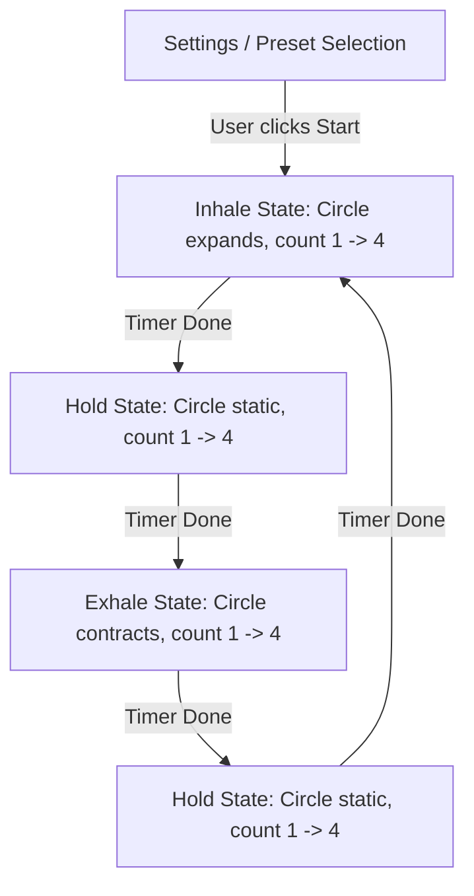

# 03. Functional Flows
```
This document maps screen transitions and breathing flows for **Breathing Pacer**.
```
---
```
## 1. Breathing Cycle Flow Chart

```
---
```
## 2. Screen & Overlay Map
*   **Main Configuration Screen**:
    *   Top: Preset selectors (Box Breathing, Relax, Energize, Custom).
    *   Center: Duration picker (1 min, 3 min, 5 min, 10 min) + Settings Gear.
    *   Bottom: "Start Breathing" CTA Button.
*   **Active Visualizer Overlay (Full Screen)**:
    *   Takes over screen. Hides status bar.
    *   Centered expanding circular canvas + text cues ("Breathe In").
    *   Bottom "Stop" button to close overlay and trigger exit ad check.
```
---
```
## Next Steps
*   To review MVVM architectures and canvas pacer codes, see [04.TECHNICAL-ARCHITECTURE.md](04.TECHNICAL-ARCHITECTURE.md).
```