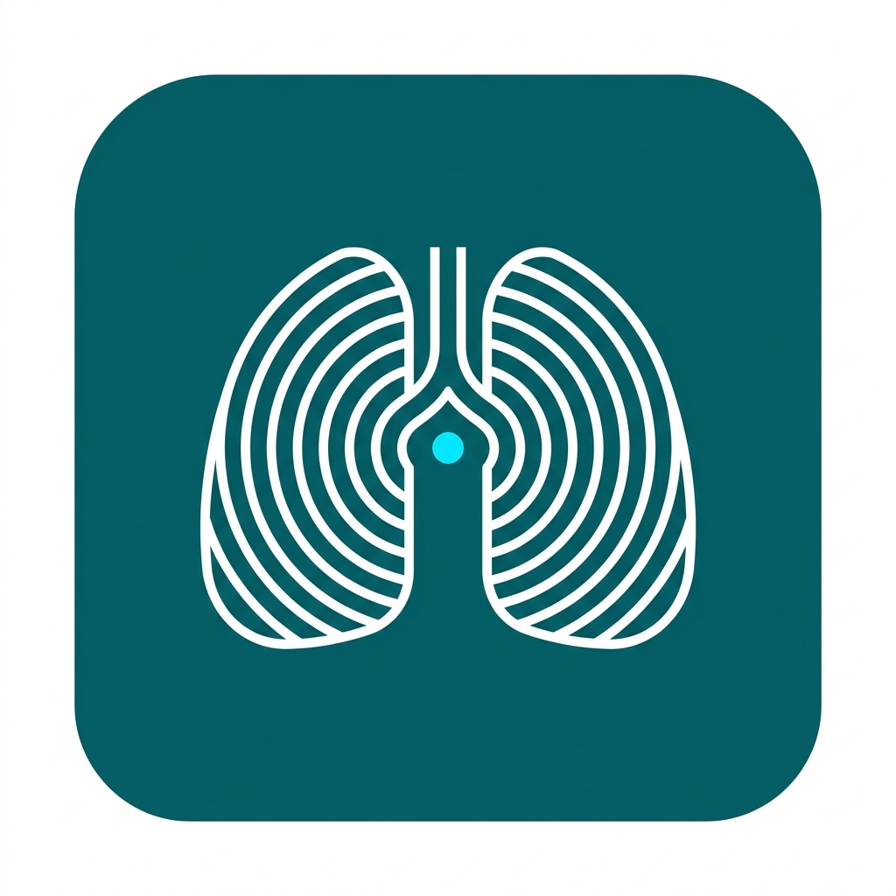

# Breathing Pacer — Master Index
`

`
Welcome to the development blueprint directory for **Breathing Pacer**.
`
---
`
## 📂 Documentation Directory Map
*   [01.PRD-REQUIREMENTS.md](01.PRD-REQUIREMENTS.md) — Personas, customizable presets, and active ad exclusions.
*   [02.UI-UX-DESIGN-SYSTEM.md](02.UI-UX-DESIGN-SYSTEM.md) — Teal color schemes and pacer sphere animations.
*   [03.FUNCTIONAL-FLOWS.md](03.FUNCTIONAL-FLOWS.md) — Guided cycle flows and fullscreen layout transitions.
*   [04.TECHNICAL-ARCHITECTURE.md](04.TECHNICAL-ARCHITECTURE.md) — ViewModels and State timer implementations.
*   [05.DATABASE-SCHEMA.md](05.DATABASE-SCHEMA.md) — Storage preferences using Jetpack DataStore.
*   [06.ADMOB-MONETIZATION-MAP.md](06.ADMOB-MONETIZATION-MAP.md) — Placements and session ad controls.
*   [07.ASO-PLAY-STORE-LISTING.md](07.ASO-PLAY-STORE-LISTING.md) — Listing descriptions and optimized search terms.
*   [08.PLAY-POLICY-SAFETY.md](08.PLAY-POLICY-SAFETY.md) — Safety declarations and permission audits.
*   [09.TESTING-ASSURANCE-PLAN.md](09.TESTING-ASSURANCE-PLAN.md) — Sequencer unit tests and QA checklists.
*   [10.TRANSLATIONS-LOCALIZATION.md](10.TRANSLATIONS-LOCALIZATION.md) — XML localization files.
*   [11.GRAPHIC-ASSETS-MANIFEST.md](11.GRAPHIC-ASSETS-MANIFEST.md) — Asset dimensions and icon layouts.
*   [12.LOGGING-ANALYTICS.md](12.LOGGING-ANALYTICS.md) — Session telemetry without personal identifiers.
*   [13.BACKLOG-TASKS.md](13.BACKLOG-TASKS.md) — Sprints board for code engineering.
`
---
`
## ☁️ GCP & Firebase API Setup & SOP
*   **Category**: Level 1 (Telemetry, UMP Consent, and AdMob)
*   **Core APIs**: `firebase.googleapis.com` (Free Tier)
*   **SOP**: Link standard session analytics, load default configuration models, and mapping layouts.
`