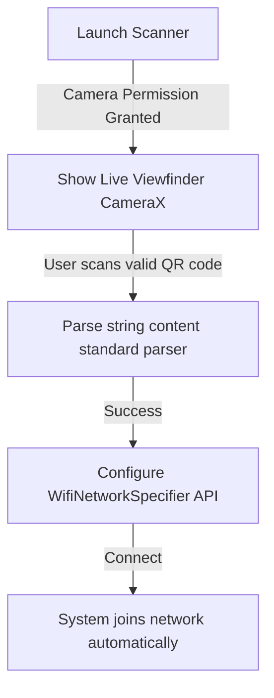

# 03. Functional Flows
```
This document details interactive sequences for **WiFi QR Sharer**.
```
---
```
## 1. WiFi QR Code Generation & Display Flow
```mermaid
```sequenceDiagram
    participant User
    participant Form
    participant QRGenerator
    participant DisplayScreen
```
    User->>Form: Input SSID="HomeNet", Password="pass", WPA
    Form->>QRGenerator: Format string "WIFI:S:HomeNet;T:WPA;P:pass;;"
    QRGenerator->>QRGenerator: Calculate QR byte matrix (offline)
    QRGenerator->>DisplayScreen: Render dynamic vector QR graphic
    DisplayScreen->>User: Display full-screen QR (Zero Ads!)
```
```
---
```
## 2. Scan & Connect Flow

```
---
```
## Next Steps
*   To review the MVVM layout structures, see [04.TECHNICAL-ARCHITECTURE.md](04.TECHNICAL-ARCHITECTURE.md).
```