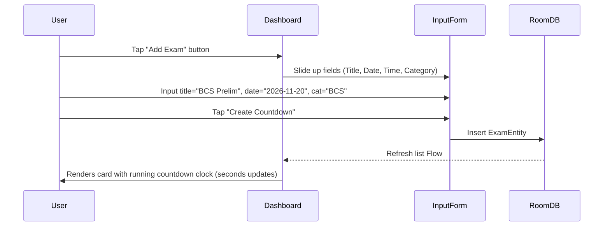
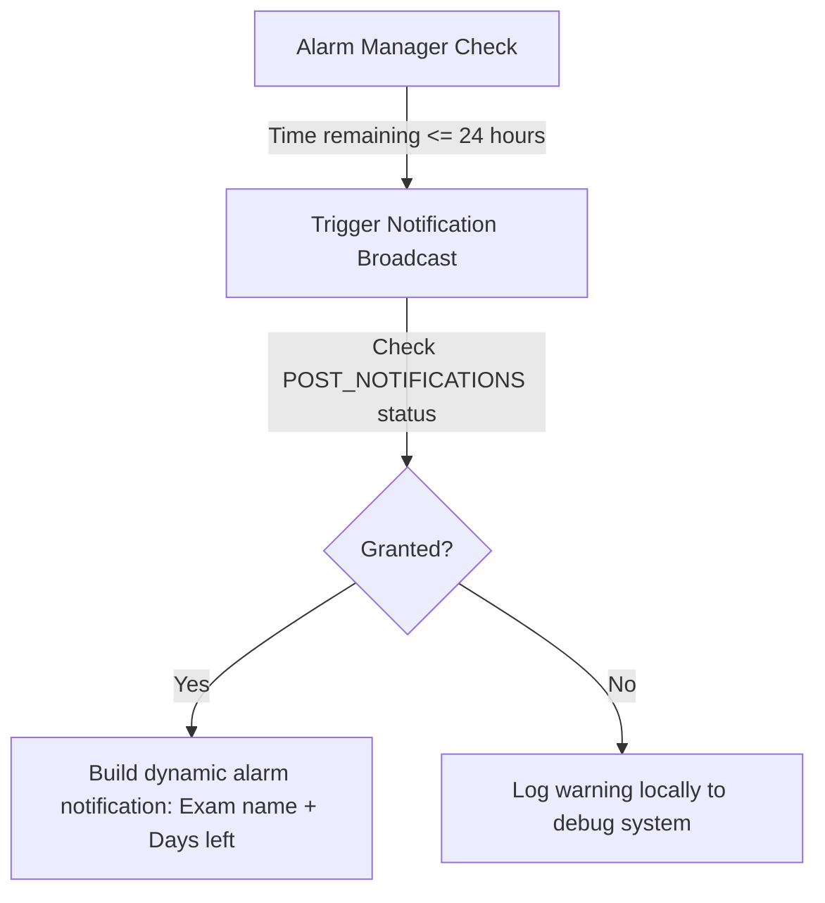

# 03. Functional Flows

This document details interactive maps for **Exam Countdown BD**.

---

## 1. Exam Addition Flow

---

## 2. Notification Dispatcher Flow

---

## Next Steps
*   To review the MVVM layout structures, see [04.TECHNICAL-ARCHITECTURE.md](04.TECHNICAL-ARCHITECTURE.md).
