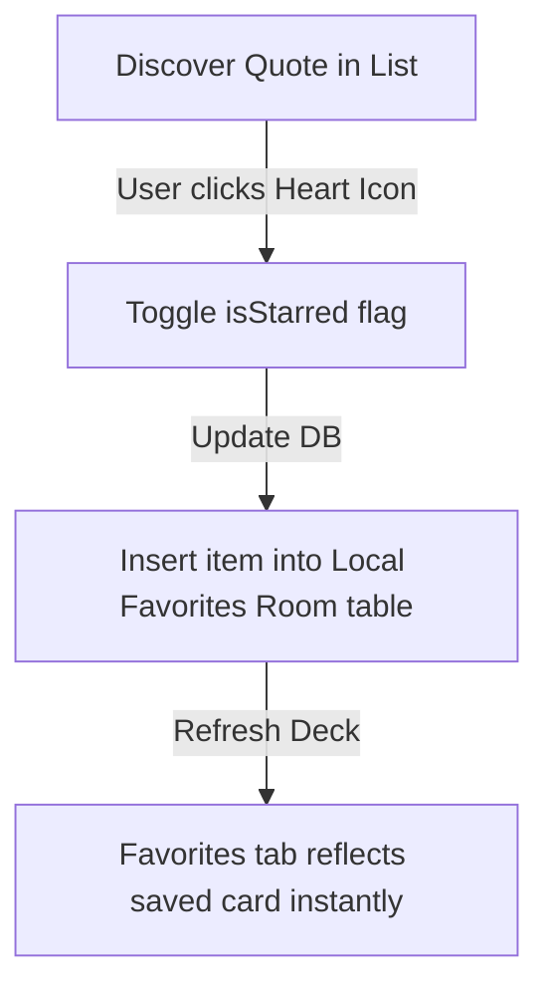

# 03. Functional Flows
`
This document details interactive sequences for **Daily Quotes Maker**.
`
---
`
## 1. Quote Graphic Export Flow
```mermaid
sequenceDiagram
    participant User
    participant Canvas
    participant ImageExporter
    participant Gallery
`
    User->>Canvas: Set text="Be persistent", font="Montserrat", bg="Gradient"
    Canvas->>Canvas: Redraw layout components (offline)
    User->>Canvas: Click "Export Image"
    Canvas->>ImageExporter: Convert Compose layout graphics into Bitmap
    ImageExporter->>Gallery: Save file using MediaStore API (watermark-free)
    Gallery-->>User: Show system success toast "Saved to Gallery!"
```
`
---
`
## 2. Favorites Catalog Selection Flow

`
---
`
## Next Steps
*   To review the MVVM layout structures, see [04.TECHNICAL-ARCHITECTURE.md](04.TECHNICAL-ARCHITECTURE.md).
`