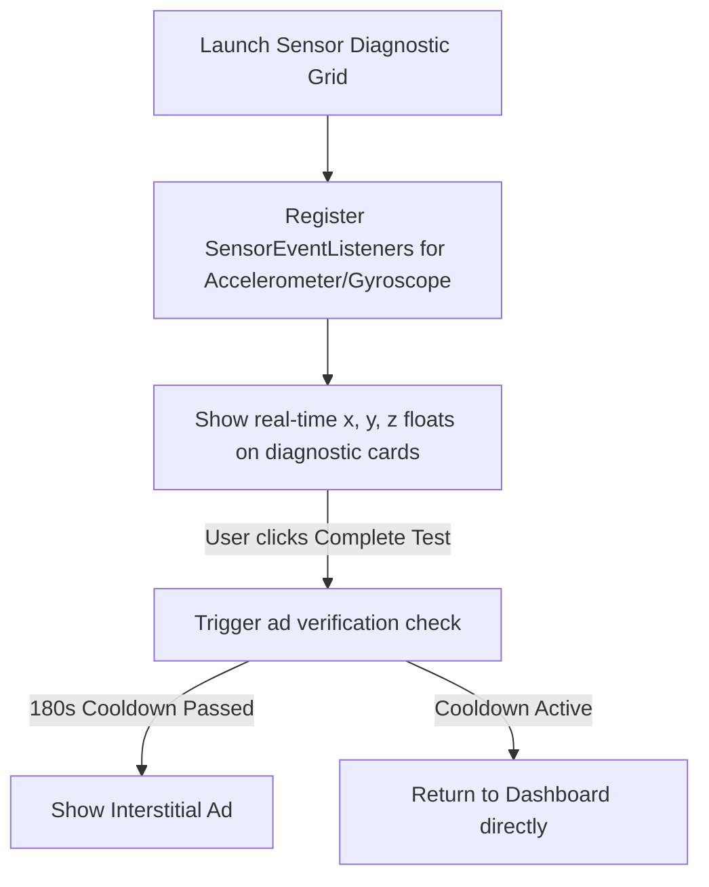

# 03. Functional Flows
```
This document details interactive sequences for **Device Info Specs**.
```
---
```
## 1. Real-time CPU Core Update Flow
```mermaid
```sequenceDiagram
    participant OS
    participant SpecsViewModel
    participant DashboardView
```
    OS->>SpecsViewModel: Emit CPU frequency updates via system files `/sys/devices/system/cpu/...`
    SpecsViewModel->>DashboardView: Update UI state flows (frequency and usage percentage)
    DashboardView->>DashboardView: Redraw live canvas charts (Zero Ads!)
```
```
---
```
## 2. Sensor Diagnostic Flow

```
---
```
## Next Steps
*   To review the MVVM layout structures, see [04.TECHNICAL-ARCHITECTURE.md](04.TECHNICAL-ARCHITECTURE.md).
```