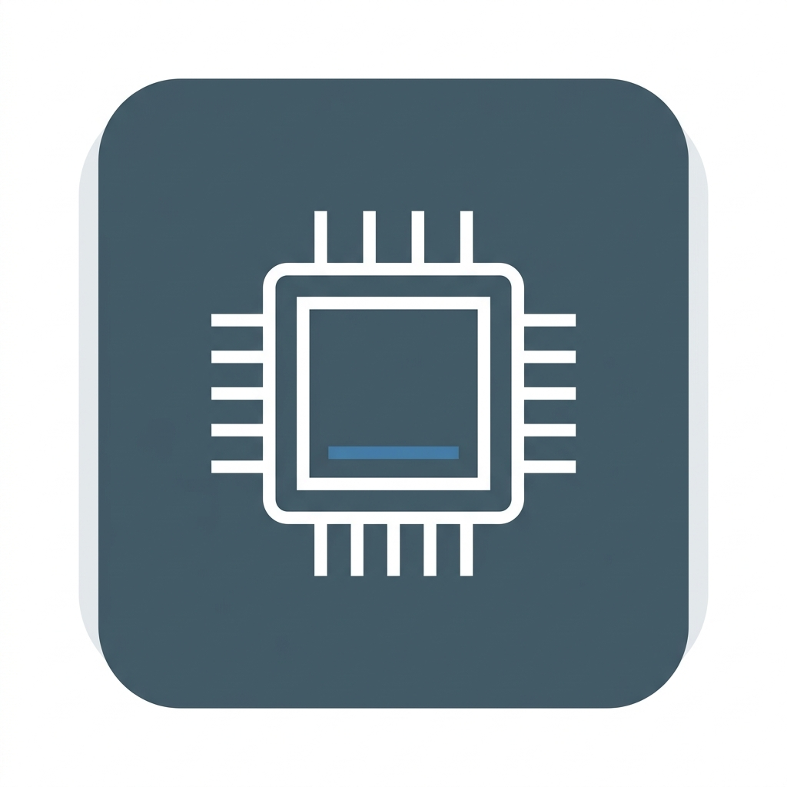

# Device Info Specs — Master Index
```

```
Welcome to the development blueprint directory for **Device Info Specs**.
```
---
```
## 📂 Documentation Directory Map
*   [01.PRD-REQUIREMENTS.md](01.PRD-REQUIREMENTS.md) — Personas, sensor checkers, and active ad exclusions.
*   [02.UI-UX-DESIGN-SYSTEM.md](02.UI-UX-DESIGN-SYSTEM.md) — Slate color schemes and readout typography scales.
*   [03.FUNCTIONAL-FLOWS.md](03.FUNCTIONAL-FLOWS.md) — Real-time CPU trackers and diagnostic charts.
*   [04.TECHNICAL-ARCHITECTURE.md](04.TECHNICAL-ARCHITECTURE.md) — ViewModels and System API memory readers.
*   [05.DATABASE-SCHEMA.md](05.DATABASE-SCHEMA.md) — Storage declarations confirming zero database needs.
*   [06.ADMOB-MONETIZATION-MAP.md](06.ADMOB-MONETIZATION-MAP.md) — Placements and diagnostic ad triggers.
*   [07.ASO-PLAY-STORE-LISTING.md](07.ASO-PLAY-STORE-LISTING.md) — Store descriptions and optimized search keywords.
*   [08.PLAY-POLICY-SAFETY.md](08.PLAY-POLICY-SAFETY.md) — Safety declarations with zero permission checks.
*   [09.TESTING-ASSURANCE-PLAN.md](09.TESTING-ASSURANCE-PLAN.md) — API parsing unit tests and QA checklists.
*   [10.TRANSLATIONS-LOCALIZATION.md](10.TRANSLATIONS-LOCALIZATION.md) — XML localization tables.
*   [11.GRAPHIC-ASSETS-MANIFEST.md](11.GRAPHIC-ASSETS-MANIFEST.md) — Asset dimensions and icon layouts.
*   [12.LOGGING-ANALYTICS.md](12.LOGGING-ANALYTICS.md) — Telemetry rules without personal identifiers.
*   [13.BACKLOG-TASKS.md](13.BACKLOG-TASKS.md) — Sprints board for code building.
```
---
```
## ☁️ GCP & Firebase API Setup & SOP
*   **Category**: Level 1 (Telemetry, UMP Consent, and AdMob)
*   **Core APIs**: `firebase.googleapis.com` (Free Tier)
*   **SOP**: Link standard session analytics, load default configuration models, and mapping layouts.
```