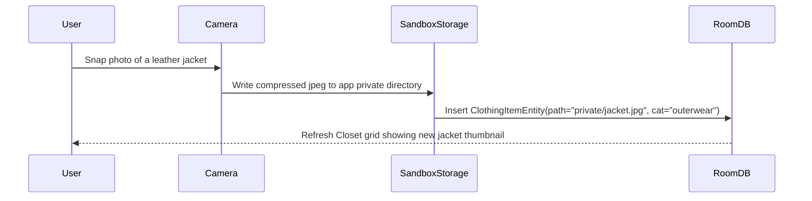
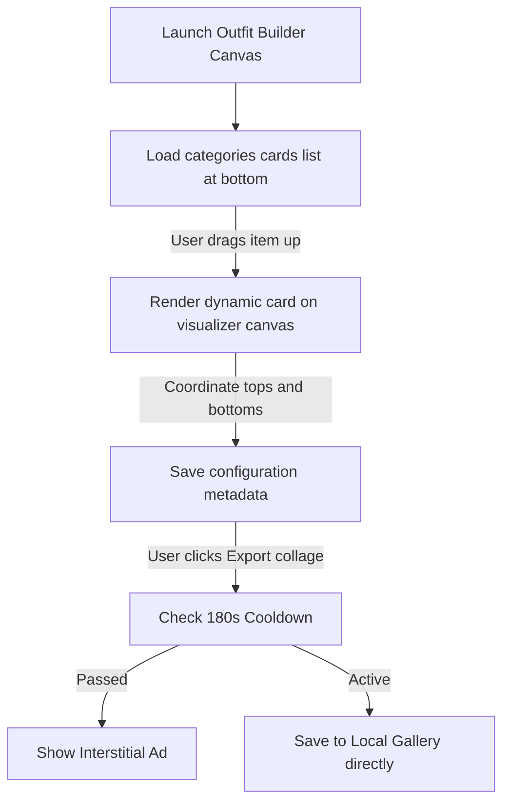

# 03. Functional Flows

This document details interactive sequences for **Outfit Canvas**.

---

## 1. Wardrobe Item Snapping Flow

---

## 2. Outfit Canvas Drag-and-Match Flow

---

## Next Steps
*   To review the MVVM layout structures, see [04.TECHNICAL-ARCHITECTURE.md](04.TECHNICAL-ARCHITECTURE.md).
