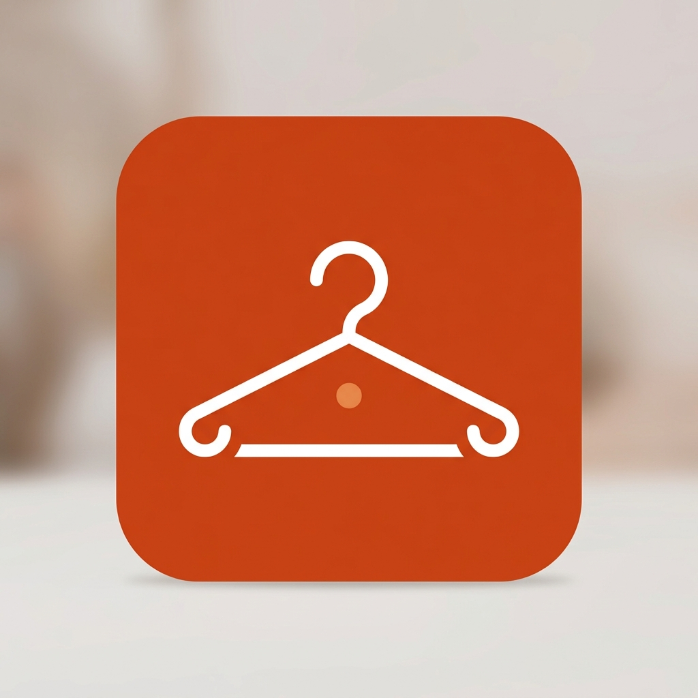

# Outfit Canvas — Master Index
`

`
Welcome to the development blueprint directory for **Outfit Canvas**.
`
---
`
## 📂 Documentation Directory Map
*   [01.PRD-REQUIREMENTS.md](01.PRD-REQUIREMENTS.md) — Personas, closet cataloging, and active ad exclusions.
*   [02.UI-UX-DESIGN-SYSTEM.md](02.UI-UX-DESIGN-SYSTEM.md) — Clay color schemes and typography scales.
*   [03.FUNCTIONAL-FLOWS.md](03.FUNCTIONAL-FLOWS.md) — Camera snaps and canvas drag matching charts.
*   [04.TECHNICAL-ARCHITECTURE.md](04.TECHNICAL-ARCHITECTURE.md) — ViewModels and Closet Category grid filters.
*   [05.DATABASE-SCHEMA.md](05.DATABASE-SCHEMA.md) — SQLite database tables and wardrobe models.
*   [06.ADMOB-MONETIZATION-MAP.md](06.ADMOB-MONETIZATION-MAP.md) — Placements and collage export ad triggers.
*   [07.ASO-PLAY-STORE-LISTING.md](07.ASO-PLAY-STORE-LISTING.md) — Store descriptions and optimized search keywords.
*   [08.PLAY-POLICY-SAFETY.md](08.PLAY-POLICY-SAFETY.md) — Safety declarations and CAMERA/READ_MEDIA_IMAGES permission audits.
*   [09.TESTING-ASSURANCE-PLAN.md](09.TESTING-ASSURANCE-PLAN.md) — Category validation unit tests and QA checklists.
*   [10.TRANSLATIONS-LOCALIZATION.md](10.TRANSLATIONS-LOCALIZATION.md) — XML localization tables.
*   [11.GRAPHIC-ASSETS-MANIFEST.md](11.GRAPHIC-ASSETS-MANIFEST.md) — Asset dimensions and icon layouts.
*   [12.LOGGING-ANALYTICS.md](12.LOGGING-ANALYTICS.md) — Closet category telemetry without personal identifiers.
*   [13.BACKLOG-TASKS.md](13.BACKLOG-TASKS.md) — Sprints board for code building.
`
---
`
## ☁️ GCP & Firebase API Setup & SOP
*   **Category**: Level 1 (Telemetry, UMP Consent, and AdMob)
*   **Core APIs**: `firebase.googleapis.com` (Free Tier)
*   **SOP**: Link standard session analytics, load default configuration models, and mapping layouts.
`