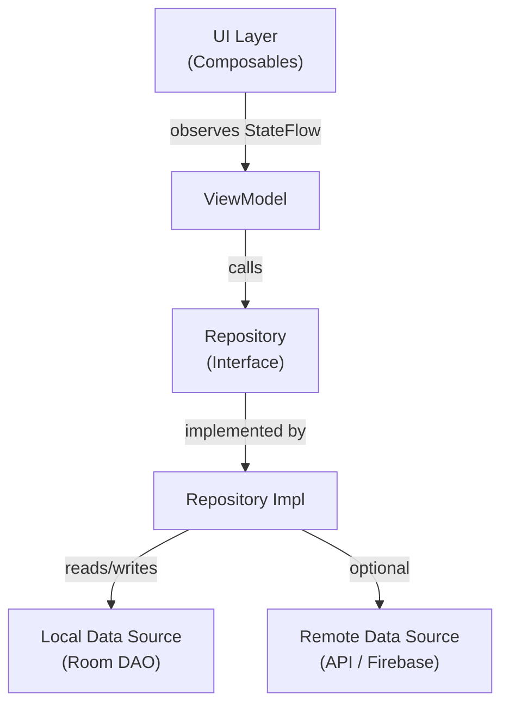
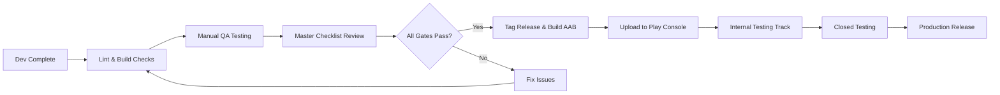
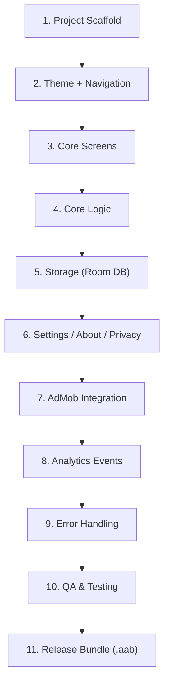

# 🛠️ Developer Guide — Savior Systems Android Portfolio
```
> **Audience:** You — the Android developer building every app in this portfolio.
> **Last Updated:** June 7, 2026
```
---
```
## 📂 Navigation Index
Before coding, ensure you have reviewed:
*   [Main README](README.md) — Portfolio-level overview and list of projects.
*   [Contributing Guidelines](CONTRIBUTING.md) — Git workflow conventions and commit standards.
*   [Master Submission Checklist](MASTER-CHECKLIST.md) — Requirements every app must pass.
*   [AI Agent Operating System](AI-AGENT-OPERATING-SYSTEM.md) — Conventions and guidelines for AI coding assistants.
```
---
```
## Table of Contents
```
- [1. Welcome \& Context](#1-welcome--context)
- [2. Mandatory Tech Stack](#2-mandatory-tech-stack)
- [3. Project Setup for Each App](#3-project-setup-for-each-app)
- [4. Architecture Rules](#4-architecture-rules)
- [5. AdMob Integration Rules](#5-admob-integration-rules)
- [6. Git Workflow](#6-git-workflow)
- [7. Quality Gates Before Submission](#7-quality-gates-before-submission)
- [8. Common Mistakes to Avoid](#8-common-mistakes-to-avoid)
- [9. Build Order for Each App](#9-build-order-for-each-app)
```
---
```
## 1. Welcome & Context
```
Welcome aboard. You are building a portfolio of **30 Android utility apps**, all published under the **Savior Systems** brand on Google Play. Every app lives in its own folder inside this repository, and every folder ships with its own complete documentation — feature specs, UI wireframes, screen inventories, the works.
```
Your job is to turn those docs into polished, production-ready apps that:
```
- Solve a clear, everyday problem for users.
- Look and feel consistent across the entire Savior Systems catalog.
- Monetize cleanly through AdMob without degrading the user experience.
- Pass Google Play review on the first submission.
```
**This guide is your single source of truth for _how_ to build.** The per-app folders tell you _what_ to build. When in doubt, this file wins.
```
### How This Repository Is Organized
```
```
Savior-Systems-Android-Projects/
├── DEVELOPER-GUIDE.md              ← You are here
├── REUSABLE-ANDROID-COMPONENTS.md  ← Shared code patterns (AdManager, theme, etc.)
├── MASTER-CHECKLIST.md             ← Pre-release checklist for every app
├── APP-01-<AppName>/
│   ├── PRD.md
│   ├── FEATURES.md
│   ├── SCREENS.md
│   └── ...
├── APP-02-<AppName>/
│   └── ...
└── ... (up to APP-30)
```
```
> [!IMPORTANT]
> Read the per-app documentation **completely** before writing a single line of code. Every app folder is designed to give you everything you need — don't skip files.
```
---
```
## 2. Mandatory Tech Stack
```
Every app in the portfolio **must** use the following stack. No exceptions, no substitutions.
```
| Layer | Technology | Notes |
|---|---|---|
| **Language** | Kotlin | 100% Kotlin — no Java files |
| **UI Framework** | Jetpack Compose | No XML layouts. All UI in Compose. |
| **Design System** | Material 3 (Material You) | Dynamic color support on Android 12+ |
| **Architecture** | MVVM + Clean Architecture | Strict layer separation (see §4) |
| **Local Database** | Room | With Kotlin Coroutines & Flow |
| **State Management** | `StateFlow` + `ViewModel` | No `LiveData` — use `StateFlow` everywhere |
| **Dependency Injection** | Hilt | Annotate all injectable classes properly |
| **Ads** | Google Mobile Ads SDK (AdMob) | Banner + Interstitial (see §5) |
| **Analytics** | Firebase Analytics | Custom events per app + standard events |
| **Consent** | Google UMP SDK | GDPR/consent flow before ads load |
| **Build System** | Gradle (Kotlin DSL) | Version Catalogs via `libs.versions.toml` |
```
### Key Library Versions (Baseline)
```
Maintain all versions in a single `libs.versions.toml` file at the project root. Here is the baseline — always check for the latest stable release before starting a new app:
```
```toml
[versions]
kotlin = "2.1.0"
compose-bom = "2025.05.00"
material3 = "1.3.2"
hilt = "2.54"
room = "2.7.1"
lifecycle = "2.9.0"
coroutines = "1.10.2"
firebase-bom = "33.14.0"
play-services-ads = "24.4.0"
ump = "3.1.0"
agp = "8.10.1"
```
[libraries]
# Define library coordinates here...
```
[plugins]
# Define plugin aliases here...
```
```
> [!TIP]
> Before starting each new app, run `./gradlew dependencyUpdates` (or use the Version Catalog Assistant plugin) to check for newer stable versions. Pin to stable only — never use alpha/beta in production builds.
```
---
```
## 3. Project Setup for Each App
```
Follow these steps **exactly** when scaffolding a new app.
```
### 3.1 Android Studio
```
- Use the **latest stable** release of Android Studio (Meerkat or newer).
- Template: **Empty Compose Activity**.
- Do **not** use the "New Project with Compose" wizard fragments — start clean.
```
### 3.2 SDK Targets
```
| Setting | Value |
|---|---|
| `minSdk` | **24** (Android 7.0 — covers 97%+ of active devices) |
| `targetSdk` | **35** (Android 15) |
| `compileSdk` | **35** |
```
### 3.3 Package Naming
```
All apps follow this convention:
```
```
com.saviorsystems.<appgroup>.<appname>
```
```
**Examples:**
```
| App | Package Name |
|---|---|
| Unit Converter | `com.saviorsystems.tools.unitconverter` |
| Daily Water Tracker | `com.saviorsystems.health.watertracker` |
| Quick Notes | `com.saviorsystems.productivity.quicknotes` |
```
> [!WARNING]
> Package names are **permanent** after publishing. Triple-check before your first release. Renaming later means publishing a brand-new listing and losing all reviews/installs.
```
### 3.4 ProGuard / R8
```
Enable R8 shrinking and obfuscation for **all release builds**:
```
```kotlin
// build.gradle.kts (app module)
android {
    buildTypes {
        release {
            isMinifyEnabled = true
            isShrinkResources = true
            proguardFiles(
                getDefaultProguardFile("proguard-android-optimize.txt"),
                "proguard-rules.pro"
            )
        }
    }
}
```
```
Keep a per-app `proguard-rules.pro` with rules for:
- Room entities (`@Entity`, `@Dao`)
- Hilt-generated classes
- Any serialization models (Gson, Kotlinx Serialization)
- Firebase classes
```
### 3.5 Adaptive Icons
```
Every app **must** provide adaptive icons:
```
```
res/
├── mipmap-anydpi-v26/
│   ├── ic_launcher.xml          ← adaptive-icon definition
│   └── ic_launcher_round.xml
├── mipmap-hdpi/
│   └── ic_launcher_foreground.webp
├── mipmap-xhdpi/
│   └── ic_launcher_foreground.webp
├── mipmap-xxhdpi/
│   └── ic_launcher_foreground.webp
└── mipmap-xxxhdpi/
    └── ic_launcher_foreground.webp
```
```
- Foreground: App-specific icon on transparent background.
- Background: Solid color from the app's primary brand color.
- Use the **Image Asset** tool in Android Studio to generate all densities.
- Test the icon shape on Pixel (circle), Samsung (squircle), and Xiaomi (rounded square) launchers.
```
### 3.6 Compose Compiler & Kotlin Version Alignment
```
Compose Compiler is now bundled with the Kotlin compiler plugin starting from Kotlin 2.0+. Ensure your `build.gradle.kts` uses the Compose Compiler Gradle plugin:
```
```kotlin
plugins {
    alias(libs.plugins.kotlin.android)
    alias(libs.plugins.kotlin.compose)  // Compose Compiler plugin
}
```
```
---
```
## 4. Architecture Rules
```
Every app follows **MVVM + Clean Architecture** with strict layer separation.
```
### 4.1 Layer Diagram
```

    style A fill:#E3F2FD,stroke:#1565C0,color:#000
    style B fill:#FFF3E0,stroke:#E65100,color:#000
    style C fill:#E8F5E9,stroke:#2E7D32,color:#000
    style D fill:#E8F5E9,stroke:#2E7D32,color:#000
    style E fill:#F3E5F5,stroke:#6A1B9A,color:#000
    style F fill:#F3E5F5,stroke:#6A1B9A,color:#000
```
```
### 4.2 Layer Responsibilities
```
| Layer | What Lives Here | What Does NOT Belong Here |
|---|---|---|
| **UI** | `@Composable` functions, navigation, UI event handlers | Business logic, direct DB calls, `Context` usage |
| **ViewModel** | UI state (`StateFlow`), user-action handlers, use-case orchestration | `Context`, `Activity`, `View`, `Intent`, direct Room calls |
| **Repository** | Data coordination, caching strategy, mapping between domain and data models | UI logic, Android framework imports |
| **Data Source** | Room DAOs, API clients, `SharedPreferences` wrappers | Business rules, presentation logic |
```
### 4.3 Hard Rules
```
1. **No Android framework references in ViewModel.**
   If you need `Context`, inject a repository or use-case wrapper that hides it. ViewModels must be unit-testable without Robolectric.
```
2. **Use sealed classes (or sealed interfaces) for UI state.**
```
   ```kotlin
   sealed interface HomeUiState {
       data object Loading : HomeUiState
       data class Success(val items: List<Item>) : HomeUiState
       data class Error(val message: String) : HomeUiState
       data object Empty : HomeUiState
   }
   ```
```
3. **Use Kotlin Coroutines for all async work.**
   - `viewModelScope` in ViewModels.
   - `Dispatchers.IO` for database / file / network operations.
   - Never use `GlobalScope`.
   - Never block the main thread.
```
4. **Repository interfaces live in the domain layer.** Implementations live in the data layer. The ViewModel depends only on the interface.
```
5. **One ViewModel per screen.** Do not share ViewModels across unrelated screens. For truly shared data, use a shared repository — not a shared ViewModel.
```
6. **Navigation is handled in the UI layer.** The ViewModel emits events (via `Channel` or `SharedFlow`); the Composable reacts and navigates.
```
### 4.4 Standard Package Structure
```
```
com.saviorsystems.<group>.<app>/
├── data/
│   ├── local/
│   │   ├── AppDatabase.kt
│   │   ├── dao/
│   │   └── entity/
│   ├── repository/
│   │   └── ItemRepositoryImpl.kt
│   └── mapper/
├── di/
│   ├── AppModule.kt
│   └── DatabaseModule.kt
├── domain/
│   ├── model/
│   ├── repository/
│   │   └── ItemRepository.kt       ← Interface
│   └── usecase/                     ← Optional, for complex logic
├── ui/
│   ├── theme/
│   │   ├── Color.kt
│   │   ├── Theme.kt
│   │   └── Type.kt
│   ├── navigation/
│   │   └── AppNavGraph.kt
│   ├── screens/
│   │   ├── home/
│   │   │   ├── HomeScreen.kt
│   │   │   └── HomeViewModel.kt
│   │   ├── settings/
│   │   └── about/
│   └── components/                  ← Reusable composables
├── util/
│   └── Extensions.kt
├── ads/
│   └── AdManager.kt                ← From REUSABLE-ANDROID-COMPONENTS.md
└── App.kt                          ← @HiltAndroidApp Application class
```
```
---
```
## 5. AdMob Integration Rules
```
Ads pay the bills — but bad ad experiences tank your ratings. Follow these rules exactly.
```
### 5.1 Use the Shared AdManager Pattern
```
Every app uses the `AdManager` singleton defined in [REUSABLE-ANDROID-COMPONENTS.md](./REUSABLE-ANDROID-COMPONENTS.md). Do not write ad-loading logic from scratch. The `AdManager` handles:
```
- Consent flow (UMP SDK)
- Banner ad loading and lifecycle
- Interstitial ad preloading, showing, and cooldown enforcement
```
### 5.2 Interstitial Frequency Cap
```
```
INTERSTITIAL_COOLDOWN = 180 seconds (3 minutes)
```
```
This is **hard-coded** in `AdManager`. Never reduce it. The timer resets after each interstitial is shown. This means:
```
- First interstitial: eligible after the user has been in the app for 180 seconds.
- Subsequent interstitials: eligible 180 seconds after the last one was dismissed.
```
### 5.3 When to Show Interstitials
```
| ✅ Allowed Trigger Points | ❌ Never Show Here |
|---|---|
| After completing a task/action (e.g., saving a note, finishing a conversion) | During text input or form filling |
| On natural navigation transitions (e.g., returning to home after a flow) | On app launch / splash screen |
| After viewing a result | During onboarding |
| | When user presses Back |
| | During error states |
| | Immediately after another ad |
```
### 5.4 Banner Ad Placement
```
- Place a single `AdView` banner at the **bottom** of the main screen.
- Use `AdSize.ANCHORED_ADAPTIVE` for responsive sizing.
- Do **not** stack multiple banners.
- Do **not** place banners that overlap interactive content.
```
### 5.5 Test Ad Unit IDs
```
During development, **always** use Google's official test ad unit IDs:
```
```kotlin
object TestAdIds {
    const val BANNER      = "ca-app-pub-3940256099942544/6300978111"
    const val INTERSTITIAL = "ca-app-pub-3940256099942544/1033173712"
}
```
```
> [!CAUTION]
> Using production ad unit IDs during development will get your AdMob account **permanently banned**. There is no appeal process. Always use test IDs until the final release build, where real IDs are injected via `BuildConfig` fields.
```
### 5.6 Production Ad ID Management
```
Store production ad unit IDs in `local.properties` (which is `.gitignore`-d) and inject them via `BuildConfig`:
```
```kotlin
// build.gradle.kts
android {
    defaultConfig {
        val adBannerId = project.findProperty("ADMOB_BANNER_ID") as? String
            ?: TestAdIds.BANNER
        val adInterstitialId = project.findProperty("ADMOB_INTERSTITIAL_ID") as? String
            ?: TestAdIds.INTERSTITIAL
```
        buildConfigField("String", "ADMOB_BANNER_ID", "\"$adBannerId\"")
        buildConfigField("String", "ADMOB_INTERSTITIAL_ID", "\"$adInterstitialId\"")
    }
}
```
```
---
```
## 6. Git Workflow
```
### 6.1 Repository Structure
```
- **One Git repository per app.** Each app is its own deployable unit with its own release cycle.
- The documentation folder (this repo) is a **separate repository** — it does not contain app source code.
```
### 6.2 Branch Naming
```
| Prefix | Purpose | Example |
|---|---|---|
| `main` | Production-ready code. Always deployable. | — |
| `develop` | Integration branch for features in progress. | — |
| `feat/` | New feature | `feat/add-export-csv` |
| `fix/` | Bug fix | `fix/crash-on-empty-list` |
| `docs/` | Documentation changes | `docs/update-readme` |
| `chore/` | Build, CI, dependency updates | `chore/update-compose-bom` |
```
### 6.3 Commit Convention — Conventional Commits
```
Every commit message follows the [Conventional Commits](https://www.conventionalcommits.org/) format:
```
```
<type>(<optional scope>): <short description>
```
<optional body>
```
<optional footer>
```
```
**Examples:**
```
```
feat(home): add search bar with filtering support
```
fix(db): handle null values in migration from v2 to v3
```
docs: update README with build instructions
```
chore(deps): bump Compose BOM to 2025.05.00
```
feat(ads): integrate interstitial with 180s cooldown
```
fix(ui): prevent crash when rotating during loading state
```
```
**Allowed types:** `feat`, `fix`, `docs`, `style`, `refactor`, `perf`, `test`, `build`, `ci`, `chore`, `revert`
```
### 6.4 Semantic Versioning
```
All apps follow **Semantic Versioning (SemVer)**:
```
```
vMAJOR.MINOR.PATCH
```
```
| Component | When to Increment | Example |
|---|---|---|
| **MAJOR** | Breaking changes, major redesigns | `v2.0.0` |
| **MINOR** | New features, backward-compatible | `v1.1.0` |
| **PATCH** | Bug fixes, minor tweaks | `v1.0.1` |
```
- First public release: `v1.0.0`
- Map to `versionCode` in `build.gradle.kts`:
```
  ```kotlin
  // v1.2.3 → versionCode = 10203
  val major = 1
  val minor = 2
  val patch = 3
  android {
      defaultConfig {
          versionCode = major * 10000 + minor * 100 + patch
          versionName = "$major.$minor.$patch"
      }
  }
  ```
```
### 6.5 Tagging Releases
```
After an app passes **all quality gates** in the [MASTER-CHECKLIST.md](./MASTER-CHECKLIST.md):
```
```bash
git tag -a v1.0.0 -m "Release v1.0.0 — Initial public release"
git push origin v1.0.0
```
```
---
```
## 7. Quality Gates Before Submission
```
> [!IMPORTANT]
> No app gets submitted to Google Play until **every single gate** below is green. Use the [MASTER-CHECKLIST.md](./MASTER-CHECKLIST.md) to track these per app.
```
### 7.1 Code Quality
```
| Gate | Requirement | How to Verify |
|---|---|---|
| Lint Errors | **0 errors** | `./gradlew lint` — must produce zero errors |
| Lint Warnings | **Review all** — fix or suppress with justification | `./gradlew lint` report |
| Kotlin Warnings | **0 warnings** | `-Werror` flag in `kotlinOptions` |
| No hardcoded strings | All user-visible strings in `strings.xml` | Lint rule `HardcodedText` |
| No unused resources | Run resource shrinking | `isShrinkResources = true` |
```
### 7.2 Performance & Size
```
| Gate | Requirement | How to Verify |
|---|---|---|
| APK/AAB size | **< 15 MB** (installed) | Check in Play Console after upload |
| Cold start time | **< 2 seconds** on mid-range device | Android Studio Profiler or `adb` logcat |
| Memory leaks | **0 leaks** | LeakCanary in debug builds |
| No ANRs | **0 ANRs** in testing | Strict Mode enabled in debug |
```
### 7.3 UX Completeness
```
| Gate | Requirement |
|---|---|
| Empty state | Every list/data screen shows a meaningful empty state |
| Loading state | Every async operation shows a loading indicator |
| Error state | Every failure shows a user-friendly error with retry option |
| Offline handling | App does not crash without network (even if features are limited) |
| Dark mode | Full Material 3 dark theme support |
| Landscape | Either supported or gracefully locked to portrait |
| Accessibility | Content descriptions on all interactive elements; minimum touch target 48dp |
```
### 7.4 Store Readiness
```
| Gate | Requirement |
|---|---|
| Privacy Policy URL | Active, accessible, and accurate |
| Data Safety form | Completed in Play Console |
| Store listing | Title, short description, full description, screenshots (phone + tablet) |
| Content rating | IARC questionnaire completed |
| App signing | Enrolled in Google Play App Signing |
| Release track | Internal testing → Closed testing → Production |
```
### Quality Gate Workflow
```

    style E fill:#FFF9C4,stroke:#F57F17,color:#000
    style F fill:#C8E6C9,stroke:#2E7D32,color:#000
    style G fill:#FFCDD2,stroke:#C62828,color:#000
```
```
---
```
## 8. Common Mistakes to Avoid
```
Learn from the mistakes so you don't repeat them. Each one of these has cost real developers real time (and real money).
```
### 🚫 The Mistake List
```
| # | Mistake | Why It Hurts | What to Do Instead |
|---|---|---|---|
| 1 | **Using `LiveData` instead of `StateFlow`** | Inconsistent with Compose's snapshot system; requires extra wrappers | Use `StateFlow` + `collectAsStateWithLifecycle()` everywhere |
| 2 | **Putting `Context` in the ViewModel** | Makes ViewModels untestable; causes memory leaks | Inject repository wrappers; use `@ApplicationContext` in Hilt only when absolutely necessary and only in data layer |
| 3 | **Hardcoding ad unit IDs in source code** | Risk of shipping test IDs to production (no revenue) or dev-testing with production IDs (account ban) | Use `BuildConfig` fields injected from `local.properties` |
| 4 | **Skipping the UMP consent flow** | Google rejects apps or disables ad serving in GDPR regions | Always initialize UMP **before** requesting ads |
| 5 | **No ProGuard rules for Room entities** | Release builds crash because R8 strips or renames entity fields | Add `@Keep` annotations or explicit ProGuard rules for all `@Entity` and `@Dao` classes |
| 6 | **Calling `GlobalScope.launch`** | Coroutines outlive the lifecycle; causes memory leaks and phantom operations | Use `viewModelScope` in ViewModels, `lifecycleScope` in Activities/Fragments |
| 7 | **Forgetting empty/error/loading states** | Users see a blank screen or a cryptic crash | Always model UI state as a sealed class with all four states |
| 8 | **Not testing on Android 7 (API 24)** | Your `minSdk` is 24. Features you assume exist may not. | Test on an API 24 emulator for every app before release |
| 9 | **Committing `local.properties` or keystore files** | Leaks API keys, ad IDs, signing credentials | Add to `.gitignore` immediately; use environment variables in CI |
| 10 | **Ignoring dark mode** | Material 3 enables it by default — broken themes look unprofessional | Define both light and dark `ColorScheme`; test both manually |
| 11 | **Showing interstitial on app launch** | Violates AdMob policy; risks account suspension | Enforce the 180-second cooldown; never show on launch |
| 12 | **Skipping accessibility** | Excludes users; may cause Play Store policy warnings | Add `contentDescription` to all images/icons; use semantic properties in Compose |
| 13 | **One massive Composable function** | Destroys recomposition performance; impossible to maintain | Extract components; keep each Composable under ~40 lines |
| 14 | **Not using `remember` and `derivedStateOf` correctly** | Unnecessary recompositions kill performance | Profile with Layout Inspector; memoize expensive computations |
| 15 | **Shipping without a privacy policy** | App rejected by Google Play immediately | Prepare the privacy policy **before** your first upload |
```
> [!TIP]
> Bookmark this list. Before every release, scan it once as a final sanity check.
```
---
```
## 9. Build Order for Each App
```
Follow this sequence for every app. Do not skip steps. Do not rearrange them. Each step builds on the one before it.
```

    style S1 fill:#E3F2FD,stroke:#1565C0,color:#000
    style S11 fill:#C8E6C9,stroke:#2E7D32,color:#000
```
```
### Step-by-Step Breakdown
```
#### Step 1 — Project Scaffold
- [ ] Create new project in Android Studio (Empty Compose Activity)
- [ ] Set package name per §3.3 naming convention
- [ ] Configure `libs.versions.toml` with all dependencies
- [ ] Add Hilt plugin and `@HiltAndroidApp` application class
- [ ] Set up `.gitignore` (include `local.properties`, `*.jks`, `.idea/`, `build/`)
- [ ] Create standard package structure per §4.4
- [ ] Initial commit: `chore: scaffold project`
```
#### Step 2 — Theme + Navigation
- [ ] Define `Color.kt`, `Type.kt`, `Theme.kt` with Material 3 light/dark schemes
- [ ] Enable dynamic color for Android 12+
- [ ] Set up `NavHost` with all planned routes
- [ ] Create placeholder screens for all destinations
- [ ] Commit: `feat(ui): add theme and navigation graph`
```
#### Step 3 — Core Screens
- [ ] Build all primary screens as Composables
- [ ] Implement UI for all four states: Loading, Success, Empty, Error
- [ ] Wire screens to navigation
- [ ] Use placeholder data (no real logic yet)
- [ ] Commit: `feat(ui): implement core screens`
```
#### Step 4 — Core Logic
- [ ] Build domain models
- [ ] Write repository interfaces
- [ ] Implement ViewModels with `StateFlow`
- [ ] Connect UI to ViewModels via `collectAsStateWithLifecycle()`
- [ ] Test with mock data
- [ ] Commit: `feat(core): implement business logic and ViewModels`
```
#### Step 5 — Storage
- [ ] Define Room entities and DAOs
- [ ] Create `AppDatabase` with proper migrations strategy
- [ ] Implement repository with Room as data source
- [ ] Provide database via Hilt `@Module`
- [ ] Swap mock data for real database reads/writes
- [ ] Commit: `feat(data): add Room database and persistence`
```
#### Step 6 — Settings / About / Privacy
- [ ] Build Settings screen (theme toggle, any app-specific settings)
- [ ] Build About screen (app version, developer info, licenses)
- [ ] Add Privacy Policy link (opens in browser)
- [ ] Store user preferences with `DataStore` or `SharedPreferences`
- [ ] Commit: `feat(ui): add settings, about, and privacy screens`
```
#### Step 7 — AdMob Integration
- [ ] Copy `AdManager` from [REUSABLE-ANDROID-COMPONENTS.md](./REUSABLE-ANDROID-COMPONENTS.md)
- [ ] Initialize UMP consent flow in `App.kt`
- [ ] Add banner ad to main screen
- [ ] Set up interstitial at approved trigger points (see §5.3)
- [ ] Verify 180-second cooldown works
- [ ] Use test ad IDs — confirm with logcat
- [ ] Commit: `feat(ads): integrate AdMob with consent flow`
```
#### Step 8 — Analytics Events
- [ ] Add Firebase Analytics dependency
- [ ] Log key user actions (screen views, feature usage, conversion events)
- [ ] Follow Firebase event naming conventions (`snake_case`, max 40 chars)
- [ ] Verify events in Firebase DebugView
- [ ] Commit: `feat(analytics): add Firebase event tracking`
```
#### Step 9 — Error Handling
- [ ] Add global exception handler (`Thread.setDefaultUncaughtExceptionHandler`)
- [ ] Ensure all coroutines have proper `try-catch` or `CoroutineExceptionHandler`
- [ ] Validate all user inputs with clear error messages
- [ ] Test edge cases: no data, huge data, special characters, device rotation
- [ ] Commit: `fix: add comprehensive error handling`
```
#### Step 10 — QA & Testing
- [ ] Run full [MASTER-CHECKLIST.md](./MASTER-CHECKLIST.md) review
- [ ] `./gradlew lint` — zero errors
- [ ] Test on minimum API (24), target API (35), and one mid-range API (30)
- [ ] Test both light and dark mode
- [ ] Test with system font scaled to maximum
- [ ] Test with TalkBack enabled
- [ ] Verify ad behavior on real device (with test IDs)
- [ ] Check installed APK size < 15 MB
- [ ] Commit: `test: complete QA pass`
```
#### Step 11 — Release Bundle (.aab)
- [ ] Switch ad unit IDs to production (via `local.properties`)
- [ ] Set correct `versionName` and `versionCode`
- [ ] Build signed `.aab`: `./gradlew bundleRelease`
- [ ] Tag the release: `git tag -a v1.0.0 -m "Release v1.0.0"`
- [ ] Upload to Play Console internal testing track
- [ ] Commit: `chore(release): prepare v1.0.0 release bundle`
```
---
```
## Quick Reference Card
```
| Item | Value |
|---|---|
| Min SDK | 24 |
| Target SDK | 35 |
| Language | Kotlin (no Java) |
| UI | Jetpack Compose + Material 3 |
| Architecture | MVVM + Clean Architecture |
| DI | Hilt |
| Async | Coroutines + StateFlow |
| Database | Room |
| Ads | AdMob (Banner + Interstitial) |
| Interstitial Cooldown | 180 seconds |
| Version Format | Semantic (v1.0.0) |
| Commit Format | Conventional Commits |
| Max APK Size | 15 MB |
| First Release Tag | v1.0.0 |
```
---
```
> **Now go build.** Pick the first app folder, read every doc in it, and start at Step 1. If something in the per-app documentation conflicts with this guide, **this guide wins**. If something isn't covered here or there, ask before guessing.
```