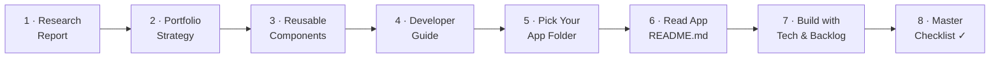
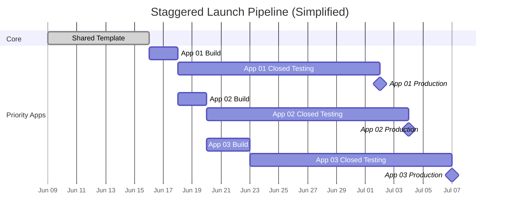

<p align="center">
  
</p>

<h1 align="center">Savior Systems — Android Projects</h1>

<p align="center">
  <strong>High-Velocity Android App Publishing · 30 Apps · One Strategic Blueprint</strong>
</p>

<p align="center">
  
  
  
  
  
</p>

---

## 📌 What Is This Repository?

This is **not** a code repository. This is the **Master Research & Planning Hub** for Savior Systems' Android portfolio.

Inside you will find **end-to-end documentation** covering:

- ✅ Market research and competitive intelligence for **30 Android app concepts**
- ✅ Portfolio-level monetization strategy (AdMob eCPM targeting across Tier-1 and South Asian markets)
- ✅ Google Play Console policy guardrails and compliance checklists
- ✅ Reusable architecture blueprints (shared Kotlin modules, ad wrappers, Room templates)
- ✅ Developer handoff documents — every app folder contains a full implementation plan, screen specs, ad trigger maps, and ASO keyword lists
- ✅ Publishing roadmap with staggered closed-testing timelines

A developer receives this repo and uses it as their **single source of truth** to build, test, and ship all 30 apps to the Google Play Store.

---

## 🗂️ Repository Structure

```
Savior-Systems-Android-Projects/
│
├── 📄 README.md                          ← You are here
├── 📄 UNIFIED-RESEARCH-REPORT.md         ← Master research: market data, eCPMs, policy, architecture
├── 📄 PORTFOLIO-STRATEGY.md              ← Portfolio-level publishing & revenue strategy
├── 📄 APP-IDEA-MATRIX.md                 ← Scored matrix of all 50 app concepts (30 selected)
├── 📄 PUBLISHING-ROADMAP.md              ← Staggered launch calendar & closed-testing timeline
├── 📄 ADMOB-MONETIZATION-PLAYBOOK.md     ← Ad format specs, eCPM targets, frequency caps
├── 📄 PLAY-CONSOLE-POLICY-GUARDRAILS.md  ← Zero-permission rules, metadata policies, risk control
├── 📄 REUSABLE-ANDROID-COMPONENTS.md     ← Shared Kotlin modules: AdManager, ConsentFlow, Room
├── 📄 AI-AGENT-OPERATING-SYSTEM.md       ← AI agent rules, prompts, and context hierarchy
├── 📄 MASTER-CHECKLIST.md                ← Pre-submission quality gate for every app
├── 📄 DEVELOPER-GUIDE.md                 ← Onboarding guide: environment setup, conventions, workflow
├── 📄 CONTRIBUTING.md                    ← Contribution standards and commit conventions
│
├── 📂 01. FocusPulse Timer/              ← Pomodoro timer (Tier-1 global)
├── 📂 02. BD Varsity CGPA Pro/           ← CGPA calculator (Bangladesh)
├── 📂 03. MicroHabit Tracker/            ← Streak-based habit tracker (Global)
├── 📂 04. Expense Diary Local/           ← Offline expense ledger (Global/SA)
├── 📂 05. Prayer Time Helper/            ← Zero-permission salat times (South Asia)
├── 📂 06. Water Log & Remind/            ← Hydration tracker (Tier-1 global)
├── 📂 07. Smart Age & BD Date/           ← Bengali calendar & age tool (Bangladesh)
├── 📂 08. Resume PDF Maker/              ← Watermark-free CV builder (Global/SA)
├── 📂 09. PDF Compress Lite/             ← Offline PDF/image compressor (Tier-1 global)
├── 📂 10. Routine Widget/                ← Jetpack Glance daily timeline (Tier-1 global)
├── 📂 11. BD Tax & VAT Calc/             ← Tax estimator (Bangladesh)
├── 📂 12. Minimalist To-Do/              ← Swipe-based task manager (Global)
├── 📂 13. Fuel Mileage Log/              ← Trip & mileage calculator (Global/SA)
├── 📂 14. English-Bangla Vocab/          ← Flashcard language learning (Bangladesh)
├── 📂 15. Breathing Pacer/               ← Guided breathing exercises (Tier-1 global)
├── 📂 16. WiFi QR Sharer/               ← QR-based WiFi sharing (Global)
├── 📂 17. Exam Countdown BD/             ← Exam timer & widget (Bangladesh)
├── 📂 18. Daily Quotes Maker/            ← Quote card generator (Global)
├── 📂 19. Device Info Specs/             ← Hardware/software info viewer (Global)
├── 📂 20. Outfit Canvas/                 ← Wardrobe planner (Tier-1 global)
├── 📂 21. ScanMaster Offline/            ← Document scanner (Global)
├── 📂 22. Color Hex Picker/              ← Designer color tool (Global)
├── 📂 23. BMI & BMR Target/              ← Health metric calculator (Global)
├── 📂 24. Tip & Split Pro/               ← Bill splitter (Tier-1 global)
├── 📂 25. InstaGrid Splitter/            ← Instagram grid image splitter (Global)
├── 📂 26. Offline Vault & Pass/          ← Local password manager (Global)
├── 📂 27. Offline Voice Note/            ← Voice memo recorder (Global)
├── 📂 28. Social Bio & Status Captions/  ← Social media bio generator (India/Global)
├── 📂 29. Auto Text Spammer/             ← Automated text repeater (Global)
├── 📂 30. Fake Call Rescue/              ← Fake incoming call simulator (Global)
│
└── 📂 .claude/                           ← AI agent configuration (CLAUDE.md, rules, prompts)
```

Each app folder contains its own comprehensive 14-file documentation suite:

```
XX. App Name/
├── 01.PRD-REQUIREMENTS.md       ← Persona, user stories, features, and ad exclusions
├── 02.UI-UX-DESIGN-SYSTEM.md     ← App-specific colors, fonts, shapes, and animations
├── 03.FUNCTIONAL-FLOWS.md       ← Screen transition diagrams and interactive flows
├── 04.TECHNICAL-ARCHITECTURE.md ← Package layouts, ViewModels, and core feature code samples
├── 05.DATABASE-SCHEMA.md        ← SQLite Room structures, indices, or DataStore keys
├── 06.ADMOB-MONETIZATION-MAP.md ← Placements, zero-ad zones, and 180s cooldown setups
├── 07.ASO-PLAY-STORE-LISTING.md ← Metadata titles, ASO search keywords, and description copy
├── 08.PLAY-POLICY-SAFETY.md     ← Permission declarations and data safety questionnaire
├── 09.TESTING-ASSURANCE-PLAN.md ← Automated unit test logic and manual QA checklist tables
├── 10.TRANSLATIONS-LOCALIZATION.md ← Core XML string resources for English, Spanish, and Bengali
├── 11.GRAPHIC-ASSETS-MANIFEST.md ← Sizing configurations for Store listing icons and mockups
├── 12.LOGGING-ANALYTICS.md      ← Non-PII Firebase analytics tracking setups
├── 13.BACKLOG-TASKS.md          <-- Five phased development sprints
└── README.md                    ← Master directory index linking all blueprints
```

---

## 🚀 For Developers — How to Use This Repo

Follow this sequence **in order**. Do not skip steps.



| Step | Action | Document |
|:----:|:-------|:---------|
| **1** | **Understand the big picture.** Read the master research covering market data, eCPM benchmarks, Play Store policy constraints, and the core-and-clone architecture. | [`UNIFIED-RESEARCH-REPORT.md`](UNIFIED-RESEARCH-REPORT.md) |
| **2** | **Learn the portfolio strategy.** Understand how 30 apps are prioritized, how Tier-1 and South Asian markets are balanced, and the revenue model. | [`PORTFOLIO-STRATEGY.md`](PORTFOLIO-STRATEGY.md) |
| **3** | **Study the shared codebase.** Review the reusable Kotlin modules — AdManager (with 180-second interstitial cap), UMP Consent Flow, Room database templates, and Compose scaffolds. | [`REUSABLE-ANDROID-COMPONENTS.md`](REUSABLE-ANDROID-COMPONENTS.md) |
| **4** | **Set up your environment.** Follow the developer guide for IDE configuration, SDK versions, Gradle setup, commit conventions, and testing standards. | [`DEVELOPER-GUIDE.md`](DEVELOPER-GUIDE.md) |
| **5** | **Pick the app folder assigned to you.** Navigate to the numbered folder (e.g., `01. FocusPulse Timer/`). | App folder `01–30` |
| **6** | **Read the app's entry point.** The local `README.md` gives you the index to all 13 sub-documents, personas, and visual preview of the app icon. | `XX. App Name/README.md` |
| **7** | **Follow the technical architecture.** Build layers and components using `04.TECHNICAL-ARCHITECTURE.md` and track tasks using `13.BACKLOG-TASKS.md`. Reference other sub-documents (PRD, schema, ads map) as needed. | `XX. App Name/04.TECHNICAL-ARCHITECTURE.md` |
| **8** | **Run the master checklist before submitting.** Every app must pass the pre-submission quality gate covering code, policy, ads, ASO, and store listing. | [`MASTER-CHECKLIST.md`](MASTER-CHECKLIST.md) |

> [!IMPORTANT]
> **Every app must be built as an isolated project** with its own unique package name, visual identity, color palette, and store listing. Do not copy-paste UI across apps. Read `PLAY-CONSOLE-POLICY-GUARDRAILS.md` for the full anti-clone compliance rules.

---

## 🏆 Top 12 Priority Apps

These are the highest-scored apps from our weighted analysis. They should be built **first**, in approximately this order:

| Rank | App Name | Primary Market | Build Time | Weighted Score |
|:----:|:---------|:---------------|:----------:|:--------------:|
| 1 | **FocusPulse Timer** | Global (Tier-1) | 2 days | 7.68 |
| 2 | **BD Varsity CGPA Pro** | South Asia (BD/IN) | 1.5 days | 7.78 |
| 3 | **MicroHabit Tracker** | Global (Tier-1) | 3 days | 7.68 |
| 4 | **Expense Diary Local** | Global / SA | 3 days | 7.63 |
| 5 | **Prayer Time Helper** | South Asia (BD) | 2 days | — |
| 6 | **Water Log & Remind** | Global (Tier-1) | 3 days | 7.35 |
| 7 | **Smart Age & BD Date** | South Asia (BD) | 2 days | 7.40 |
| 8 | **Resume PDF Maker** | Global / SA | 7 days | 7.20 |
| 9 | **PDF Compress Lite** | Global (Tier-1) | 6 days | 7.15 |
| 10 | **Routine Widget** | Global (Tier-1) | 5 days | 7.38 |
| 11 | **BD Tax & VAT Calc** | South Asia (BD) | 2 days | 7.43 |
| 12 | **Minimalist To-Do** | Global | 2 days | — |

> [!TIP]
> The full 50-concept scored matrix — including reserve and backup apps — is available in [`APP-IDEA-MATRIX.md`](APP-IDEA-MATRIX.md).

---

## 🛠️ Tech Stack

All 30 apps share a common technology foundation:

| Layer | Technology | Purpose |
|:------|:-----------|:--------|
| **Language** | Kotlin | Primary development language |
| **UI Framework** | Jetpack Compose | Declarative, modern Android UI |
| **Design System** | Material 3 (Material You) | Dynamic theming, adaptive layouts |
| **Local Storage** | Room Database | Offline-first structured data |
| **Preferences** | DataStore (Preferences) | Settings, consent flags, user prefs |
| **Background Work** | WorkManager | Notifications, reminders, scheduled tasks |
| **Ads SDK** | Google AdMob SDK | Banner, Interstitial, Rewarded, App Open |
| **Consent** | Google UMP SDK | GDPR/ATT consent management |
| **Analytics** | Firebase Analytics | Event tracking, user engagement metrics |
| **Widgets** | Jetpack Glance | Home screen widgets (select apps) |
| **Build System** | Gradle (Kotlin DSL) | Dependency management, build variants |
| **Min SDK** | API 24 (Android 7.0) | ~97% device coverage |

> [!NOTE]
> **Zero external paid APIs.** Every app is fully offline-capable using local computation, Room caching, and system-level intents. No third-party backend services are required.

---

## 📅 Publishing Strategy

Google Play Console requires all new apps from personal developer accounts to pass a **14-day closed testing period** with a minimum of **12 opted-in testers** before production release.

Our staggered launch plan:

```
Week 1         Build shared core template (AdManager, Consent, Room)
Week 2         App 01 built → Submit to closed testing ──┐
Week 2–3       Build Apps 02, 03, 04 → Submit sequentially │ 14-day hold
Week 4         App 01 clears closed testing ───────────────┘ → Production 🚀
Week 4–5       Apps 02, 03, 04 clear → Rolling production launches
Week 5–8       Continue build-submit-launch pipeline for Apps 05–12
Week 8+        Reserve apps (13–30) enter the pipeline
```



> [!WARNING]
> **Do not submit multiple apps simultaneously to closed testing from the same account** without staggering by at least 2–3 days. Simultaneous submissions can trigger Google's automated spam review. See [`PUBLISHING-ROADMAP.md`](PUBLISHING-ROADMAP.md) for the full calendar.

---

## 📊 Project Status

| Milestone | Status |
|:----------|:------:|
| Market Research & Competitive Analysis | ✅ Complete |
| App Scoring & Selection (50 → 30) | ✅ Complete |
| Portfolio Strategy & Revenue Model | ✅ Complete |
| Play Store Policy Audit | ✅ Complete |
| Reusable Architecture Design | ✅ Complete |
| App-Level Documentation (Apps 01–20) | ✅ Complete (14/14 files + Icon) |
| App-Level Documentation (Apps 21–30) | 🔄 In Progress |
| Root-Level Strategy Docs | ✅ Complete |
| Developer Guide & Onboarding | ✅ Complete |
| App Development | ⬚ Not Started |
| Closed Testing & Production Launch | ⬚ Not Started |

<p align="center">
  
</p>

---

## 📚 Key Documents Quick Links

| Document | Description |
|:---------|:------------|
| [`UNIFIED-RESEARCH-REPORT.md`](UNIFIED-RESEARCH-REPORT.md) | Master research — market data, eCPMs, policy, architecture |
| [`PORTFOLIO-STRATEGY.md`](PORTFOLIO-STRATEGY.md) | Revenue strategy, market segmentation, app prioritization |
| [`APP-IDEA-MATRIX.md`](APP-IDEA-MATRIX.md) | Full 50-concept scored matrix with selection verdicts |
| [`PUBLISHING-ROADMAP.md`](PUBLISHING-ROADMAP.md) | Week-by-week launch calendar and closed-testing schedule |
| [`ADMOB-MONETIZATION-PLAYBOOK.md`](ADMOB-MONETIZATION-PLAYBOOK.md) | Ad format specs, eCPM targets, IVT protection rules |
| [`PLAY-CONSOLE-POLICY-GUARDRAILS.md`](PLAY-CONSOLE-POLICY-GUARDRAILS.md) | Zero-permission rules, metadata uniqueness, anti-clone compliance |
| [`REUSABLE-ANDROID-COMPONENTS.md`](REUSABLE-ANDROID-COMPONENTS.md) | Shared Kotlin modules: AdManager, ConsentFlow, Room, Theme |
| [`AI-AGENT-OPERATING-SYSTEM.md`](AI-AGENT-OPERATING-SYSTEM.md) | AI assistant rules, context hierarchy, prompt templates |
| [`MASTER-CHECKLIST.md`](MASTER-CHECKLIST.md) | Pre-submission quality gate (code, policy, ads, ASO, listing) |
| [`DEVELOPER-GUIDE.md`](DEVELOPER-GUIDE.md) | Environment setup, conventions, workflow, testing standards |
| [`CONTRIBUTING.md`](CONTRIBUTING.md) | Contribution standards, branch naming, commit conventions |

---

<p align="center">
  <sub>Built with 🔥 by <strong>Savior Systems</strong> · 2026</sub>
</p>
